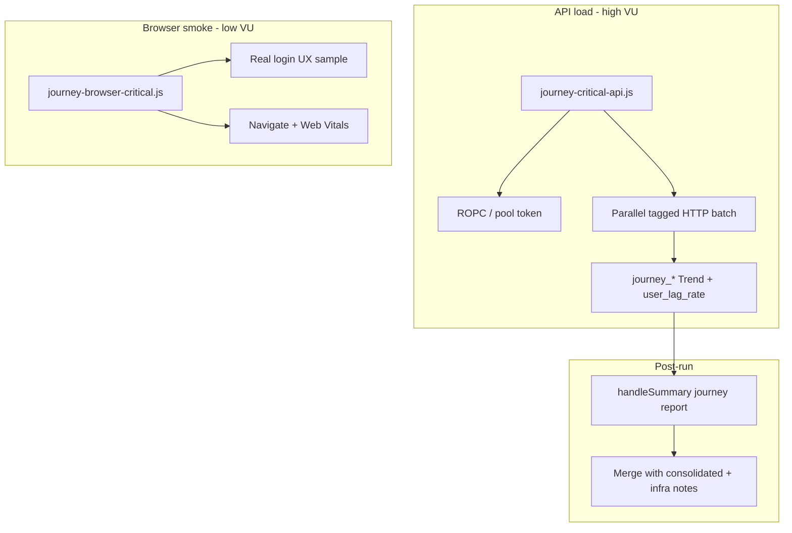

# Ibernia k6 Load Testing — Implementation Analysis Report

Analysis is based on the current `load-testing-k6` tree (~70 k6 JS files, ~57 `*-load.js` baseline scripts, 27 `lib/` helpers).

**Status:** Analysis only — no code changes in this document.

---

## Current k6 Implementation Summary

### Where tests live

| Area | Path | Role |
|------|------|------|
| **k6 scripts** | `k6/` | Domain load tests: `clients/`, `clients-profile/`, `cashflows-timeline/`, `cashflows-income/`, `cashflows-finances/`, `cashflows-reports/`, `cashflows-wealth/`, `identity/`, `api-smoke/`, `full-platform/` |
| **Shared libraries** | `lib/` | Auth, HTTP observe, perf collection, adaptive throttle, full-platform phases, cleanup, consolidated reports |
| **Runners** | `runners/*.ps1` | Provision, suite, baseline, full-platform, generic `run-k6.ps1` |
| **User pool** | `tools/pool-cli/`, `data/user-pool/{env}/` | SQLite leases, slice JSON for k6 |
| **Docs** | `docs/` | `user-pool.md`, `adaptive-throttling.md`, `consolidated-api-performance.md` |
| **Reports** | `reports/` | Adaptive latency MD/JSON, consolidated API perf MD/JSON/PDF, per-run slices |

There is **no Dockerfile** in this folder and **no k6 browser** (`k6/browser`) usage. Puppeteer appears only via `md-to-pdf` for PDF reports.

### How tests are executed

1. **Direct:** `k6 run -e SIGNUP_ROPC_CLIENT_ID=... -e SIGNUP_ROPC_CLIENT_SECRET=... k6/...`
2. **Pool-backed (typical at scale):** PowerShell runners lease users → set `USE_USER_POOL=1` + `POOL_SLICE_FILE` → run k6 → `pool-cli release`
3. **Main runners:**
   - `run-baseline-concurrent-users.ps1` — N users in parallel jobs; each user runs all ~57 scripts sequentially at **VUS=1** per script
   - `run-baseline-single-user.ps1` — one user, full catalog
   - `run-all-modules.ps1` — one representative script per domain, **VUS=N** (default 100), modules run **sequentially**
   - `run-full-platform.ps1` — orchestrator with leased pool
   - `provision-users.ps1` — HTML Identity signup → import pool

### Target environments

- **Default (hard-guarded):** `https://dev-identity.ibernia.it`, `https://dev-api.ibernia.it`, portal references `https://dev.ibernia.it/...`
- Override only with `ALLOW_NON_DEV=1`
- Pool envs: `dev` (primary), also `qa` / `staging` folders under `data/user-pool/`

### Users, accounts, and test data

- **Provisioned advisors:** `User01@gmail.com` … via `k6/identity/k6-identity-signup.js` (`AUTO_PASSWORD=indexed` → `User@01!`, etc.)
- **Pool:** SQLite at `data/user-pool/dev/pool.db`; **lease** gives exclusive users per `run-id`; **sticky VU** = `users[(__VU - 1) % N]`
- **Fallback file:** `lifecycle-users.json` (gitignored) with `email`, `password`, optional `token`, `advisorId`
- **Synthetic clients/plans:** created per VU with tagged last names (`k6tl-{runTag}`, `listseed{runTag}`, etc.); **teardown** deletes by needle
- **Users are reused** across runs (pool rows persist); within a run, concurrent scripts usually map **one pool user per VU**
- **Not realistic for:** real Stripe subscriptions, device limits, production entitlements — dev uses **`load_tester`** bypass (see below)

### Authentication and bypass logic

- **Primary API auth:** ROPC `POST /connect/token` with client `k6-load-test-client` (or pasted JWT)
- **Signup path:** minimal HTML `GET/POST /Account/Register` (not full SPA login)
- **`load_tester=true` claim** required for module bypass when `RequireLoadTesterClaimForBypass` is on; validated in orchestrator and signup export flows
- **Machine smoke:** `client_credentials` — **403** on advisor CRUD (documented)
- **No** client-view / shared-link JWT flows in any script
- **Device-limit / subscription bypass:** not modeled explicitly; dev relies on API `LoadTesting` + `load_tester` claim (README checklist)

### API-only vs browser / user journeys

| Mode | Present? |
|------|----------|
| HTTP API load | **Yes** — entire suite |
| Full browser / click-to-paint | **No** |
| Multi-step “screen journey” in one iteration | **Partial** — `k6-full-platform-orchestrator.js`, seeded scripts (client→plan→verify→load one endpoint), suite scripts (parallel scenarios on one cashflow) |
| Identity OIDC redirect (real login UX) | **No** — ROPC/HTML register instead |

### Realistic behavior?

- **Partially.** Scripts are organized by **Angular screen routes** (comments like `https://dev.ibernia.it/cashflows/{id}/timeline`) but each load script usually **hammers one endpoint** (or one CRUD verb), not the UI’s parallel fan-out.
- **Think time:** optional `THINK_SEC` (often **0**); orchestrator uses **`THINK_SEC` default 0.2s** between sequential steps.
- **Ramp-up:** most scripts use **`constant-vus`** (immediate full concurrency). Ramp exists on orchestrator (`LOAD_MODE=ramp`, `RAMP_STAGES`) and is **not** the default for baseline/module runners.
- **Retries:** orchestrator can retry signup/ROPC with `POST_RETRY_SLEEP_SEC`; load loops do not simulate UI retry/polling patterns.

---

## Current Test Coverage

### By domain (API surface)

`lib/platform-api-catalog.js` defines the **intended** dev API catalog. Baseline discovers **~57** `*-load.js` scripts across:

- **clients** — list, search, CRUD, get-by-id, get-by-cashflow, plans-per-user, full lifecycle
- **clients-profile** — get client, get cashflows for client, put client, advisor list
- **timeline** — timelines, timelines/financing, events default/custom/post/delete, suites
- **income / finances / reports / wealth** — per-screen GET/POST/PUT/DELETE + domain suites

**Smoke / special (not in 57-script baseline):**

- `k6/identity/k6-identity-signup.js`, `k6-ropc-token-inspect.js`, `k6-client-credentials-token-smoke.js`, `k6-dev-api-bearer-smoke.js`
- `k6/clients/k6-clients-create-open-profile-smoke.js`
- `k6/full-platform/k6-full-platform-orchestrator.js`

### What is not in the repo (gaps vs product journeys)

No k6 references to: **share client view**, **client shared link**, **client password setup**, **assumption update** as a named flow, **plan recalculate** as a dedicated journey, **advisor dashboard** as a composite route, or **frontend** assets.

The main Ibernia app code is largely **absent** from this git workspace (many deleted root files in status), so journey→API mapping below combines **k6 comments + catalog + orchestrator sequence** and flags **API paths to confirm in Swagger/dev**.

---

## Current Metrics and Thresholds

### Built-in k6 metrics (all HTTP scripts)

| Metric | Used? | Threshold in `options`? |
|--------|-------|-------------------------|
| `http_req_duration` | Yes | **Rarely** — only `k6-events-custom-load.js` tags `name:events_custom_get` with `p(95)` / optional `p(99)` |
| `http_req_failed` | Yes | Yes — typically `rate<0.05`–`0.15`, or `rate<1` when `RELAX_HTTP_REQ_FAILED` |
| `checks` | Yes | Yes — `rate>0.78`–`0.9` (pass if HTTP status/body checks succeed) |
| `http_req_duration` p90/p95/p99 (global) | Computed in reports | **Not** enforced as thresholds except events-custom SLA |
| Per-endpoint latency | Partial | HTTP **tags** `name:...` on requests; consolidated report groups by path when `CONSOLIDATED_PERF=1` |
| Per-user-journey latency | **No** | — |
| Browser metrics | **No** | — |

### Custom metrics

| Type | Examples | Thresholds on custom metrics? |
|------|----------|-------------------------------|
| **Trend** | `clients_screen_get_by_id_ms`, `cashflows_reports_post_forecast_ms`, `*_suite_*_ms`, `api_perf_duration_ms` | **No** — recorded in `handleSummary` JSON, not in `options.thresholds` |
| **Counter** | `*_success`, `*_errors`, `api_perf_requests`, `api_perf_failures` | **No** |
| **Rate** | — | **None defined** (`user_lag_rate`, `business_failure_rate` do not exist) |
| Adaptive | `adaptive_api_latency_ms` | Used for **abort**, not pass/fail thresholds |

### Opt-in reporting (not pass/fail by default)

- **`CONSOLIDATED_PERF=1`:** cross-module MD/PDF; flags APIs **>100ms** / slow capture **>300ms**; does not fail the test on user-perceived lag
- **`ENABLE_ADAPTIVE_THROTTLE=1`:** per-endpoint p95 in rolling window; default **`MAX_ACCEPTABLE_API_MS=500`** (docs note dev reality is often **~2s+** on Events)
- **Per-script JSON:** `singleApiHandleSummaryFactory` → e.g. `k6/clients/reports/...-report.json` with avg/p95 for that script’s Trend

### What k6 can tell you today

- HTTP success/failure rates and status-code checks per request
- Per-request and per-tag (`name:`) latency distributions in summary and consolidated reports
- Which **API endpoints** were slow under load (especially with consolidated + slow spill)
- Early stop when adaptive throttle sees sustained high latency (opt-in)
- Module/402 diagnostics via `RELAX_*` and full-platform probe

### What k6 cannot tell you today

- **Click → screen ready** or Angular render time
- **End-to-end journey** latency (login → open client → open plan → edit → recalc → save) as one metric
- **User lag rate** (% of journeys over UX budget)
- **Business failure** (e.g. empty chart, wrong projection) vs HTTP 200
- **Client-view** or **shared-link** experience
- **Infrastructure saturation** (CPU, DB pool, Railway) — not wired to k6 output
- Whether lag is **frontend state**, **parallel call waterfall**, or **one slow API** hidden in a mean

---

## Why User Lag Is Not Being Detected

### Confirmed gaps in this codebase

1. **API-only, single-endpoint focus** — A user feeling slowness on “open financial plan” likely waits for **several parallel APIs + JS**; most scripts measure **one** call in a tight loop.
2. **No journey timers** — Nothing wraps “start navigation → last critical API + render idle.”
3. **Thresholds are loose and HTTP-centric** — Typical: `checks rate>0.9`, `http_req_failed rate<0.05`. A **3–9s** response can still **pass** if status is 200 (consolidated reports already show multi-second Reports/forecast calls).
4. **Custom Trends without thresholds** — Screen Trends (`*_ms`) are written to JSON summaries but **do not fail** the run.
5. **No `user_lag_rate` / `business_failure_rate`** — Lag is not defined as a first-class Rate.
6. **p95/p99 rarely gate CI** — Only `k6-events-custom-load.js` enforces tagged p95/p99; baseline concurrent run does not.
7. **Think time usually zero** — Unrealistic burstiness vs human pacing; can hide queueing effects users see under steady use.
8. **Default load shape = sudden** — `constant-vus` and baseline “100 users × full catalog” stress **breadth of APIs**, not ramped **concurrent journeys** on critical paths.
9. **Row-0 login pattern** — Many scripts login **once** in `setup()` with lifecycle row 0, then many VUs share that token pattern or seed from row 0 — not identical to 100 real advisors each doing independent login + dashboard.
10. **Shared cashflow / suite contention** — Suite scripts document HTTP **500** under shared-plan writes; that’s real pain but different from “UI feels slow at 200 OK.”
11. **Auth shortcut** — ROPC + `load_tester` bypass ≠ production login, entitlements, or client-view tokens.
12. **Missing product flows** — Share/recalculate/assumption/client portal **not tested**.
13. **Frontend not in scope** — Client-side slowness (change detection, chart redraw, polling) invisible to k6 HTTP.
14. **Retries/polling not modeled** — UI may poll until ready; k6 sees one GET, not “waited 8s across 4 polls.”
15. **Reporting vs failing** — Consolidated report is excellent for **analysis** but **`ContinueOnError`** and lack of journey thresholds mean runs **pass** while users complain.

---

## Real Ibernia User Journeys to Test

*API lists are **inferred** from existing k6 coverage + catalog; **confirm** share/recalculate/assumption paths in dev Swagger before implementation.*

| Journey | Frontend screen (dev) | Backend APIs (typical) | Seq / parallel | Acceptable wait (proposal) | k6 coverage | Proposed metric | p95 / lag threshold (v1) |
|---------|----------------------|------------------------|----------------|----------------------------|-------------|-----------------|--------------------------|
| **Advisor login** | Identity + redirect to app | `POST /connect/token` (+ SPA may call userinfo) | Sequential | **< 2s** to usable token | **Partial** — ROPC only, not OIDC | `journey_login_duration` | p95 **1500ms**, p99 **3000ms** |
| **Advisor dashboard load** | `/clients` | `GET /api/v1/Clients/{advisorId}/all` (+ possible parallel metadata) | Often parallel in SPA | **< 2.5s** list usable | **Partial** — `clients_get_all`, list-load | `journey_dashboard_load_duration` | p95 **2500ms**, p99 **5000ms** |
| **Open client** | `/clients` → profile/detail | `GET /api/v1/Clients/{id}` | Usually sequential after list | **< 2s** | **Partial** — `clients_screen_get_by_id` | `journey_open_client_duration` | p95 **2000ms**, p99 **4000ms** |
| **Load client financial plan / cashflow** | `/cashflows/{id}/…` entry | `GET /api/v1/cashflows/{id}`, `GET .../timelines`, `GET .../financial`, `GET /api/v1/Reports/{id}` | **Parallel** fan-out | **< 3s** shell ready | **Partial** — separate load scripts, not one journey | `journey_cashflow_load_duration` | p95 **3000ms**, p99 **6000ms** |
| **Update assumption** | Plan settings / client inflation / scenario inputs | Likely `PUT /api/v1/Clients` and/or scenario/report bodies | Sequential | **< 2s** save acknowledged | **Not covered** | `journey_save_assumption_duration` | p95 **2000ms**, p99 **4000ms** |
| **Recalculate plan** | Reports / projections UI | `POST /api/v1/Reports/{id}`, `POST .../scenario`, heavy GET forecast | Sequential compute | **< 5s** (heavy) | **Partial** — `post-forecast`, `post-scenario` isolated | `journey_cashflow_recalculate_duration` | p95 **5000ms**, p99 **8000ms** |
| **Save changes** | Finances/income/wealth tabs | `PUT`/`POST` financial line items, `PUT /Clients` | Per screen | **< 2s** | **Partial** — per-verb load tests | `journey_save_changes_duration` | p95 **2500ms**, p99 **5000ms** |
| **Share client view** | Share dialog / grant access | **Unknown** — not in catalog | — | **< 3s** | **Not covered** | `journey_share_client_view_duration` | p95 **3000ms**, p99 **6000ms** |
| **Client opens shared link** | Public/client portal route | Grant/token exchange APIs (TBD) | Sequential | **< 3s** | **Not covered** | `journey_client_view_open_duration` | p95 **3000ms**, p99 **6000ms** |
| **Client sets password / logs in** | Identity client flow | Register/confirm/login endpoints | Sequential | **< 3s** | **Not covered** | `journey_client_auth_duration` | p95 **3000ms**, p99 **6000ms** |
| **Client views shared financial plan** | Read-only plan view | Read-only cashflow/report GETs | Parallel reads | **< 4s** | **Not covered** | `journey_client_plan_view_duration` | p95 **4000ms**, p99 **7000ms** |

### Cross-cutting rates (proposed)

- **`user_lag_rate`** — fraction of journey iterations where duration > lag budget (e.g. 3s critical / 5s recalc)
- **`business_failure_rate`** — journeys failing semantic checks (empty body, missing ids, wrong chart payload)
- **`auth_failure_rate`** — login/token acquisition failures

---

## Proposed k6 Improvements

### Architecture (high level)



### Files to change (existing)

| File / area | Change |
|-------------|--------|
| `k6/cashflows-income/common-income-screen.js` (and re-exports) | Add `startJourney`/`endJourney`, `user_lag_rate`, `business_failure_rate`; standard tags `journey`, `critical` |
| `lib/k6-http-observe.js` | Tag all requests with `journey` + `critical` |
| `lib/platform-api-catalog.js` | Add share/client-view/recalculate endpoints once known |
| `k6/full-platform/k6-full-platform-orchestrator.js` | Emit `journey_*` metrics per phase; tighten thresholds; default `THINK_SEC` realistic |
| Screen `*-load.js` (priority: clients list, get-by-id, cashflow get, reports forecast) | Optional thin wrappers calling shared journey helpers |
| `runners/run-baseline-concurrent-users.ps1` | Add **ramp ladder** mode (10→150 users) capturing journey JSON |
| `runners/BaselinePlan.ps1` | Tag scripts `critical` vs `secondary` |
| `docs/consolidated-api-performance.md` | Section for journey SLOs + lag rate |

### Files to add (new)

| New file | Purpose |
|----------|---------|
| `lib/k6-journey-metrics.js` | Trends, Rates, timers, lag/failure helpers |
| `lib/k6-journey-steps-advisor.js` | Login → dashboard → open client → load plan (parallel GET bundle) |
| `lib/k6-journey-steps-cashflow.js` | Assumption save, recalc, save changes |
| `lib/k6-journey-steps-client-view.js` | Share + client portal (once APIs known) |
| `k6/journeys/k6-journey-advisor-critical.js` | Main advisor SLO script |
| `k6/journeys/k6-journey-client-view.js` | Client shared-link script |
| `k6/journeys/k6-journey-ramp-scaling.js` | Ramp stages 10→150 with journey thresholds |
| `k6/browser/k6-browser-advisor-smoke.js` (optional) | Low-VU real login + navigation timing |
| `docs/journey-slo.md` | Metric definitions, budgets, scaling rules |

### Tagging strategy

On every HTTP request:

```javascript
tags: {
  name: 'reports_forecast_post',
  journey: 'cashflow_recalculate',
  critical: 'true',
  screen: 'reports',
}
```

k6 thresholds example:

```javascript
'http_req_duration{journey:cashflow_recalculate,critical:true}': ['p(95)<5000'],
```

### API vs browser

| Layer | VUs (dev proposal) | Role |
|-------|-------------------|------|
| **API journey** | 10–150 (ramp tests) | SLO enforcement, scaling limit |
| **API endpoint load** | Keep existing 57 scripts for regression | Endpoint capacity |
| **Browser journey** | **3–10 VUs** max | Validate OIDC, bundle load, LCP/INP on 2–3 critical routes; expensive, run nightly not per PR |

### Ramp / scaling test structure

Use **`ramping-vus`** or stepped PowerShell wrapper:

**10 → 25 → 50 → 75 → 100 → 150** active journey VUs, **5–10 min** per step, **sticky pool user per VU**.

At each step capture: journey p95/p99, `user_lag_rate`, `http_req_failed`, `business_failure_rate`, plus **manual/automated** Railway DB CPU, connection pool, 5xx rate.

### Results after each run

1. k6 exit code from **journey thresholds** (not only checks)
2. `reports/journeys/{run-id}.json` — per-journey p95/p99, lag rate, failures
3. Update `reports/consolidated/consolidated-api-performance.md` with “critical journey” section
4. One-page scaling summary: **max safe users** = last step passing all rules

---

## Recommended Metrics

| Metric | Timer start | Timer stop | Success | Lag | Failure | p95 (v1) | p99 (v1) |
|--------|-------------|------------|---------|-----|---------|----------|----------|
| `journey_login_duration` | Before ROPC/token | Token acquired + `load_tester` validated | Token OK | > 1500ms | No token / invalid claim | 1500ms | 3000ms |
| `journey_dashboard_load_duration` | Before clients list API | `GET .../all` 200 + non-empty or valid empty | 200 + check | > 2500ms | 4xx/5xx or check fail | 2500ms | 5000ms |
| `journey_open_client_duration` | Before `GET /Clients/{id}` | 200 + id match | 200 + body check | > 2000ms | else | 2000ms | 4000ms |
| `journey_cashflow_load_duration` | Before parallel plan bundle | All critical GETs done | all checks pass | > 3000ms | any critical fail | 3000ms | 6000ms |
| `journey_save_assumption_duration` | Before assumption PUT/POST | 200/201 | persisted check | > 2000ms | else | 2000ms | 4000ms |
| `journey_cashflow_recalculate_duration` | Before forecast/scenario POST | 200 + payload check | semantic check | > 5000ms | else | 5000ms | 8000ms |
| `journey_save_changes_duration` | Before save PUT/POST | 200/201 | check | > 2500ms | else | 2500ms | 5000ms |
| `journey_share_client_view_duration` | Before share API | Grant created | business check | > 3000ms | else | 3000ms | 6000ms |
| `journey_client_view_open_duration` | Before client link resolve | Plan shell APIs ready | checks | > 3000ms | else | 3000ms | 6000ms |
| `user_lag_rate` | — | — | — | iteration > journey budget | Rate add on lag | **< 5%** | — |
| `business_failure_rate` | — | — | — | — | semantic check fail | **< 2%** | — |
| `auth_failure_rate` | — | — | — | — | login/token fail | **< 1%** | — |

---

## Recommended Thresholds (first version)

```javascript
thresholds: {
  http_req_failed: ['rate<0.01'],
  'http_req_duration{critical:true}': ['p(95)<1500'],

  journey_login_duration: ['p(95)<1500', 'p(99)<3000'],
  journey_dashboard_load_duration: ['p(95)<2500', 'p(99)<5000'],
  journey_open_client_duration: ['p(95)<2000', 'p(99)<4000'],
  journey_cashflow_load_duration: ['p(95)<3000', 'p(99)<6000'],
  journey_save_assumption_duration: ['p(95)<2000', 'p(99)<4000'],
  journey_cashflow_recalculate_duration: ['p(95)<5000', 'p(99)<8000'],
  journey_save_changes_duration: ['p(95)<2500', 'p(99)<5000'],
  journey_share_client_view_duration: ['p(95)<3000', 'p(99)<6000'],
  journey_client_view_open_duration: ['p(95)<3000', 'p(99)<6000'],

  user_lag_rate: ['rate<0.05'],
  business_failure_rate: ['rate<0.02'],
  auth_failure_rate: ['rate<0.01'],
},
```

Tune after first baseline on dev (consolidated data already shows Reports/forecast **p95 in multi-second range** under load).

---

## Ramp Test Plan to Find Scaling Limit

### Steps

| Step | Active journey VUs | Duration (suggested) |
|------|-------------------|----------------------|
| 1 | 10 | 5 min |
| 2 | 25 | 5 min |
| 3 | 50 | 5 min |
| 4 | 75 | 5 min |
| 5 | 100 | 5 min |
| 6 | 150 | 5 min (only if step 5 clean) |

Script: new `k6-journey-ramp-scaling.js` with `ramping-vus` or orchestrated PowerShell loop reusing **same journey** each step.

### Capture per step

| Signal | Source |
|--------|--------|
| `journey_*` p95 / p99 | k6 summary |
| `user_lag_rate`, `business_failure_rate`, `http_req_failed` | k6 Rates |
| App CPU/memory | Railway / host metrics |
| DB CPU/memory, pool usage, slow queries | DB observability |
| 500/403/timeout | API logs + k6 `http_req_failed` tags |
| Container restarts | Railway events |

### Safe scaling limit rule

**Highest step where all hold:**

- `http_req_failed` **< 1%**
- `business_failure_rate` **< 2%**
- `user_lag_rate` **< 5%**
- Critical `journey_*` p95 within table above
- Infra not saturated (CPU < ~80% sustained, DB pool not exhausted, no restart storm)

If step 5 passes but 6 fails → **safe limit = 100 journey VUs** (example).

**Note:** Today’s `run-baseline-concurrent-users.ps1` (100 users × 57 scripts × VUS=1) measures **API catalog throughput across tenants**, not this journey-based limit — keep both, but use journey ramp for **user-visible** capacity.

---

## Observability Gaps

| Capability | Current in k6/repo | Gap |
|------------|-------------------|-----|
| Structured logs + request IDs | `X-Correlation-Id` on **events-custom** only | Extend to all journey requests; align with API logging |
| Frontend ↔ backend correlation | Partial header | Need shared trace id from SPA |
| Per-endpoint duration logging | Consolidated perf + slow spill **>300ms** | Not tied to journey; need server-side same ids |
| Slow query logging | Not in k6 | Required on DB during ramp |
| DB pool metrics | Not in k6 | Railway/Postgres exporter |
| CPU/memory | Not in k6 | Railway dashboards |
| Frontend error logging | None in k6 | Sentry/AppInsights/etc. |
| Frontend performance timing | None | LCP/INP via browser tests or RUM |
| External API / Duende timing | Not isolated | Log STS latency separately |
| Client-view JWT / grant logs | Not tested | Needed for share journeys |

**Recommend:** mandatory `X-Correlation-Id` + `X-Journey` on k6 and SPA; single dashboard overlaying k6 step time vs API log duration for same id.

---

## Risks and Blockers

1. **Missing product API map** for share/client-view/recalculate/assumption in this repo — blockers for accurate scripts.
2. **`load_tester` bypass** — load results may **understate** prod entitlement/latency.
3. **ROPC ≠ real login** — token acquisition faster/different than users.
4. **Dev data size** — advisors with few clients vs production list sizes.
5. **Teardown/login at 100 users** — teardown re-logins sequentially; already mitigated via `k6-teardown-timeout.js` but long runs.
6. **False confidence** — passing `checks` + loose `http_req_failed` while p95 is seconds (seen in consolidated reports).
7. **No CI gate on journeys** — only `user-pool.yml` maintenance workflow today.
8. **Browser test cost** — flakiness and Duende UI changes.

---

## Questions / Clarifications Needed

1. Exact REST paths for **share client view**, **client portal login**, and **recalculate** (same as `POST /Reports/{id}` or separate engine?).
2. Product **SLOs** per journey (ms) for dev vs prod.
3. What “**assumption update**” maps to in API (client `inflationRate`, scenario body, cashflow fields?).
4. Should scaling limit be **concurrent advisors** or **concurrent client-view users** (different pools)?
5. Is **ROPC** acceptable for load, or must journey tests use **authorization code + PKCE** like the SPA?
6. Railway services to monitor (API, Identity, DB names) and existing dashboards?
7. Should **100-user baseline catalog** remain as API regression while **journey ramp** becomes the release gate?

---

## Suggested Implementation Phases

| Phase | Scope | Outcome |
|-------|--------|---------|
| **1 — Foundations** | `lib/k6-journey-metrics.js`, tagging, `user_lag_rate` / `business_failure_rate`, document SLOs | Shared primitives, no new product APIs |
| **2 — Advisor critical path** | `k6-journey-advisor-critical.js`: login → dashboard → open client → parallel cashflow load; thresholds | Detect lag users actually feel on core advisor flow |
| **3 — Cashflow mutations** | Assumption save, recalc, save changes journeys + thresholds | Cover edit/recalc slowness |
| **4 — Client view** | After API discovery: share + client portal journeys | Close biggest product gap |
| **5 — Ramp / scaling** | `run-journey-ramp.ps1` + reporting template | Defined **safe user count** |
| **6 — Browser smoke (optional)** | 3–5 VUs, nightly, 2 routes | Catch frontend-only lag |
| **7 — CI gate** | Fail PR/nightly on journey thresholds + publish consolidated+journey report | k6 fails when users would feel lag |

---

## Bottom line

The repo is a mature **dev API load-testing framework** with excellent **per-endpoint** and **consolidated** reporting, but it is **not yet a user-journey SLO system**. Users feel lag because the UI waits on **multi-call, possibly slow workflows** (especially reports/recalc), while k6 mostly proves **HTTP success** on **isolated endpoints** with **weak latency gates**. The path forward is journey-level Trends/Rates, tagged parallel bundles matching the SPA, ramp tests with `user_lag_rate`, and (for share/client flows) new scripts once APIs are documented.

Phase 1–2 implementation can start after share/recalculate API paths and target SLOs are confirmed.

---

## Phase 1–2 implementation (completed)

| Item | Path |
|------|------|
| Journey metrics library | `lib/k6-journey-metrics.js` |
| Advisor critical journey | `k6/journeys/k6-journey-advisor-critical.js` |
| Run guide | Script header + section below |

```powershell
cd C:\Users\gulle\source\repos\load-testing-k6
$env:STS_SECRET = '...'
node tools/pool-cli/bin/pool-cli.js lease --count 10 --run-id journey-adv --env dev --out data/user-pool/dev/pool-slice-journey-adv.json
k6 run k6/journeys/k6-journey-advisor-critical.js `
  -e USE_USER_POOL=1 -e POOL_SLICE_FILE=data/user-pool/dev/pool-slice-journey-adv.json `
  -e SIGNUP_ROPC_CLIENT_ID=k6-load-test-client -e SIGNUP_ROPC_CLIENT_SECRET=$env:STS_SECRET `
  -e VUS=10 -e DURATION=5m
node tools/pool-cli/bin/pool-cli.js release --run-id journey-adv --env dev
```

Summary JSON: `reports/journeys/k6-journey-advisor-critical-summary.json`

---

*Generated from implementation analysis of `load-testing-k6` (June 2026).*
