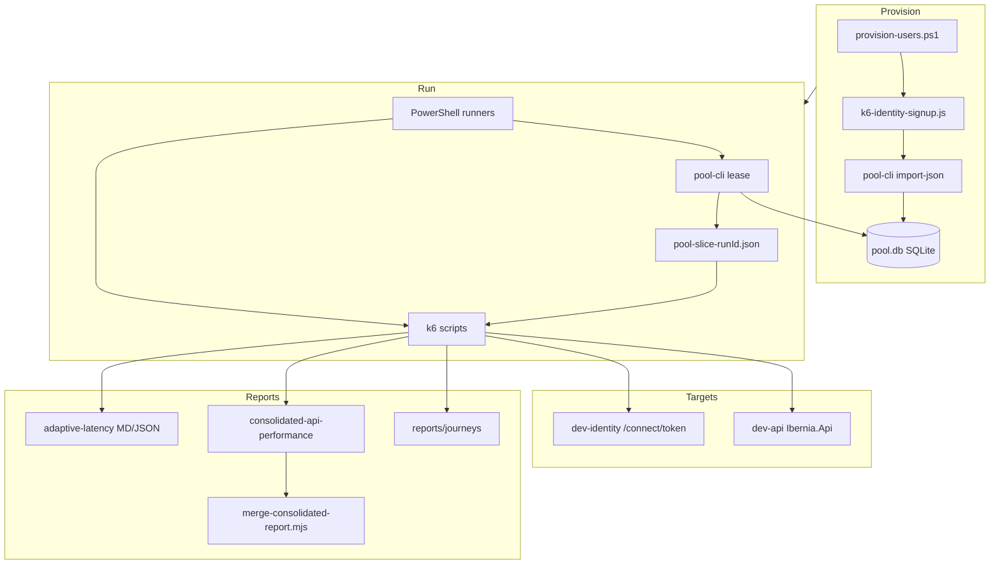

# Load testing automation — current implementation

This document describes how **load-testing-k6** automates Ibernia **dev** load and performance testing today: layout, auth, user pool, k6 scripts, PowerShell runners, reporting, CI, and operational constraints. It is the umbrella reference; topic-specific guides remain in linked files under `docs/`.

**Scope:** non-production hosts only (`dev-identity.ibernia.it`, `dev-api.ibernia.it`) unless `ALLOW_NON_DEV=1`.

---

## 1. Purpose and outcomes

| Goal | How the repo delivers it |
|------|---------------------------|
| Register and reuse test advisors | HTML signup (`k6/identity/k6-identity-signup.js`), **pool-cli** SQLite store |
| Exercise Ibernia.Api at scale | ~56 `*-load.js` scripts + suite/orchestrator scripts |
| Multi-user concurrency without collisions | **Lease** N pool users → immutable **pool slice** JSON → sticky `VU → user` mapping |
| Module entitlement bypass on dev | ROPC via **`k6-load-test-client`** + **`load_tester=true`** claim |
| Cross-module latency baselines | **Consolidated perf** slices + merge → MD/JSON/PDF |
| Graceful stop under degradation | **Adaptive throttling** (opt-in) |
| Realistic advisor UX timing | **Journey** script (`k6-journey-advisor-critical.js`) with step SLOs |
| Security regression (IDOR) | `pool-cli verify-advisor-clients-isolation`, k6 smoke |

---

## 2. High-level architecture



**Control plane vs data plane**

- **pool-cli** (Node 22+, `node:sqlite`) is the only writer to `data/user-pool/{env}/pool.db`.
- **k6** reads leased slice files and lifecycle JSON; it never mutates the database.
- **PowerShell runners** orchestrate lease → sequential or parallel k6 invocations → release (in `finally`).

---

## 3. Repository layout

| Path | Role |
|------|------|
| `k6/` | Executable test scripts (domain folders + `identity/`, `api-smoke/`, `journeys/`, `full-platform/`) |
| `lib/` | Shared JS: lifecycle, auth, cleanup, perf/adaptive/journey helpers, API catalog |
| `runners/` | PowerShell automation: provision, baselines, suite, full-platform, `run-all-modules` |
| `tools/pool-cli/` | User pool CLI (lease, import, verify ROPC, security audit) |
| `tools/merge-consolidated-report.mjs` | Merges perf slices + spill logs into consolidated report |
| `tools/parse-perf-spill-from-log.mjs` | Parses `__K6_PERF_SLOW__` lines from k6 stdout |
| `data/user-pool/{env}/` | `pool.db`, leased `pool-slice-*.json` (gitignored) |
| `reports/` | Generated artifacts (adaptive, consolidated, journeys) — mostly gitignored patterns |
| `docs/` | Focused guides (this file + user-pool, consolidated perf, adaptive throttle, security, etc.) |
| `.github/workflows/user-pool.yml` | Scheduled pool GC + optional ROPC verify |

**Script inventory (approximate)**

| Category | Count | Examples |
|----------|-------|----------|
| `*-load.js` | 56 | Per-endpoint or per-screen sustained load |
| Suite loads | 7 | `k6-*-suite-load.js` (parallel scenarios in one script) |
| Smoke / inspect | 5 | `api-smoke`, `client-credentials`, advisor isolation, create-open-profile |
| Identity | 3 | signup, ROPC inspect, client credentials |
| Journey | 1 | `k6-journey-advisor-critical.js` |
| Full platform | 1 | `k6-full-platform-orchestrator.js` |
| Lifecycle (non `-load`) | 1 | `k6-client-full-lifecycle.js` (included in baseline plan) |

**Domain folders under `k6/`**

| Folder | API surface |
|--------|-------------|
| `clients/` | `POST/PUT/DELETE/GET` Clients, `GET …/all`, `GET …/search`, cashflow create, by-cashflow |
| `clients-profile/` | Client by id, PUT client, advisor all, client cashflows |
| `cashflows-timeline/` | Timelines, financing timelines, Events default/custom/post |
| `cashflows-income/` | Cashflow, financial, income CRUD |
| `cashflows-finances/` | Income + expense financial CRUD |
| `cashflows-reports/` | Reports GET/POST, scenario, forecast |
| `cashflows-wealth/` | Wealth dashboard, assets, liabilities |

Each domain typically has:

- `common-*-screen.js` — shared env, login, metrics, `recordOutcomeWithBuckets`, teardown hooks
- One script per HTTP operation or user flow (`k6-*-get-*-load.js`, etc.)
- Optional `k6-*-suite-load.js` combining multiple tags in one run

---

## 4. Environments and safety

### Default hosts

| Variable | Default |
|----------|---------|
| `IDENTITY_BASE` | `https://dev-identity.ibernia.it` |
| `BASE_URL` | `https://dev-api.ibernia.it` |

Scripts call `assertDevIdentityHost` / `assertApiBase` (or equivalent) and **throw** if the host is not dev/localhost unless `ALLOW_NON_DEV=1`.

### Secrets (never committed)

| Variable | Used by |
|----------|---------|
| `SIGNUP_ROPC_CLIENT_SECRET` or `STS_SECRET` | ROPC, pool-cli verify, runners |
| `SIGNUP_ROPC_CLIENT_ID` | Default `k6-load-test-client` |

`.gitignore` excludes `lifecycle-users.json`, `pool.db`, slice JSON, and band state files.

### Pool environments

`--env dev|qa|staging` maps to `data/user-pool/{env}/`. **All documented runners default to `dev`.** There is no production pool in this repo.

---

## 5. Authentication and tokens

### User tokens (primary load path)

1. **ROPC** — `lib/auth/ropc.js` → `POST {IDENTITY_BASE}/connect/token` (password grant).
2. **Lifecycle row** — `lifecycle-users.json` or pool slice: `{ email, password, token?, advisorId? }`.
3. **Login helper** — `lifecycleLoginAcquireToken()` in `lib/k6-client-lifecycle.js` (password or refresh; optional persisted token).
4. **Advisor subject** — `resolveAdvisorSub(token)` from JWT `sub` (or `identity-user-sub-map.json` override).

### Load-tester bypass (dev API modules)

When Stripe/module gates are on, user tokens from **`k6-load-test-client`** need claim **`load_tester=true`** (see README). Scripts call `validateLoadTesterClaim()` when `JOURNEY_REQUIRE_LOAD_TESTER_CLAIM` / `FULL_PLATFORM_REQUIRE_LOAD_TESTER_CLAIM` are enabled (default on for journeys/full-platform).

### Machine tokens (smoke only)

- `k6/identity/k6-client-credentials-token-smoke.js` — `client_credentials` grant.
- `k6/api-smoke/k6-dev-api-bearer-smoke.js` — Bearer GET (often **403** on advisor-scoped routes).

### HTML signup (provision + optional orchestrator)

- `lib/k6-identity-html-register.js` — minimal GET/POST `/Account/Register`.
- Default provision path: `AUTO_PASSWORD=indexed`, email confirm follow (unless `-SkipEmailConfirmFollow`).

Indexed password rules are documented in [user-pool.md](user-pool.md) (`User@01!` vs `User@101`).

---

## 6. User pool — implementation detail

### Data model (SQLite)

Users are rows with lease state: **active** ↔ **leased** (by `run_id`, `expires_at`). See [user-pool.md](user-pool.md) for the state machine.

### Typical workflow

```powershell
cd C:\Users\gulle\source\repos\load-testing-k6
$env:STS_SECRET = '<dev-k6-load-test-client-secret>'

# 1) Provision (signup → export → import)
.\runners\provision-users.ps1 -UserCount 50 -SignupRunTag pool20260518

# 2) Lease for a run
node tools/pool-cli/bin/pool-cli.js lease --count 20 --run-id my-run --env dev `
  --out data/user-pool/dev/pool-slice-my-run.json

# 3) k6 with pool
k6 run k6/clients/k6-clients-list-load.js `
  -e USE_USER_POOL=1 -e POOL_SLICE_FILE=data/user-pool/dev/pool-slice-my-run.json `
  -e SIGNUP_ROPC_CLIENT_ID=k6-load-test-client -e SIGNUP_ROPC_CLIENT_SECRET=$env:STS_SECRET `
  -e VUS=20 -e DURATION=5m

# 4) Always release
node tools/pool-cli/bin/pool-cli.js release --run-id my-run --env dev
```

Runners perform steps 2–4 automatically.

### VU ↔ user mapping

`lib/user-pool/load-pool-slice.js`:

- `useUserPool()` — true when `USE_USER_POOL=1` or `POOL_SLICE_FILE` set.
- `userForVu(users, vu)` — **sticky**: index `(__VU - 1) % N` when `vus ≤ N`.

`lib/k6-default-vus.js` — `scenarioVusForPool(poolSize, scriptTag)` caps scenario VUs to pool size.

`lib/k6-client-lifecycle.js` — `loadLifecycleUsers()` reads pool slice when pool mode is on, else `lifecycle-users.json`.

### pool-cli commands (automation surface)

| Command | Purpose |
|---------|---------|
| `import-json` | Upsert from lifecycle export |
| `lease` / `release` | Allocate users for a run |
| `stats` / `gc` | Ops visibility; clear expired leases |
| `verify-ropc` | Spot-check login + `load_tester` claim |
| `audit-advisor-clients` | Count clients per advisor (`GET …/all`) |
| `verify-advisor-clients-isolation` | IDOR tests (exit 1 on failure) |
| `deactivate` / `purge` | Pool maintenance |
| `purge-k6-events` | DELETE custom events matching k6 naming patterns |

---

## 7. k6 script patterns (how automation is structured)

### Pattern A — Seeded load (most `*-load.js`)

1. **`setup()`** — Often row 0 login + `runTag` (or per-VU seed on first iteration).
2. **First iteration per VU** — POST seed resource with unique **last-name needle** (`k6srch{runTag}vu{VU}`, etc.); verify GET; cache ids on `globalThis.__k6*SeedByVu`.
3. **`default` function** — Repeated GET/POST under load (`constant-vus`, duration from `DURATION`).
4. **`teardown()`** — Cannot see VU `globalThis`; re-login and `deleteClientsAndPlansByLastNameNeedle()` from `lib/k6-load-cleanup.js` using needle + `GET …/Clients/{advisorId}/all`.

This pattern is why **teardown re-fetches the full client list** — a deliberate k6 limitation workaround.

### Pattern B — Screen-oriented metrics

`common-clients-profile-screen.js` (and income/timeline variants) provide:

- Dev host guards, `HTTP_TIMEOUT`, `THINK_SEC`
- `recordOutcomeWithBuckets` → status/latency trends + error buckets
- `singleApiHandleSummaryFactory` → per-script JSON under `k6/.../reports/`
- Optional `wrapHandleSummaryWithConsolidatedPerf` when `CONSOLIDATED_PERF=1`

`k6/clients/common-clients-screen.js` re-exports the profile screen barrel (clients list surface shares profile helpers).

### Pattern C — Suite scripts

e.g. `k6-cashflows-timeline-suite-load.js` — multiple `constant-vus` scenarios in one file; combined `handleSummary` report.

### Pattern D — Full-platform orchestrator

`k6/full-platform/k6-full-platform-orchestrator.js` + `lib/k6-full-platform-phases.js`:

- Sequential **Clients → Profile → Timeline → Events → Income → Finances → Reports → Wealth → cleanup** per iteration.
- User sources: lifecycle file, **pool slice**, or `FULL_PLATFORM_HTML_SIGNUP=1`.
- `LOAD_MODE`: `vus` | `shared` | `ramp`.
- Optional `probeModulesAccess` for 402 diagnostics.

Runner: `runners/run-full-platform.ps1`.

### Pattern E — Advisor journey (UX SLOs)

`k6/journeys/k6-journey-advisor-critical.js`:

- Steps: login → dashboard (`GET …/all`) → open client → parallel plan/cashflow loads.
- Metrics: `lib/k6-journey-metrics.js` (step timers, lag budget, thresholds).
- Endpoint forensics: `lib/k6-journey-endpoint-stats.js` (per-step resolved paths).
- Warns when advisor client count > `JOURNEY_ADVISOR_CLIENT_WARN_ABOVE` (default 200).
- Outputs under `reports/journeys/`.

Does **not** modify baseline `*-load.js` scripts.

### HTTP instrumentation chain

```
http.get/post → observeHttp(res, { endpoint, method, module })
  → recordAdaptiveHttp (if ENABLE_ADAPTIVE_THROTTLE)
  → recordApiPerformance (if CONSOLIDATED_PERF / PERF_CAPTURE_REQUEST_CONTEXT)
```

`lib/k6-http-observe.js` is the single hook point used by refactored paths; older scripts may call collectors indirectly via `recordOutcomeWithBuckets` in income-screen helpers.

---

## 8. Shared libraries (`lib/`)

| Module | Responsibility |
|--------|----------------|
| `k6-client-lifecycle.js` | Signup/lifecycle flows, token acquire/refresh, JWT parse, `loadLifecycleUsers`, client model builders |
| `k6-load-cleanup.js` | Teardown by last-name needle; cashflow discovery via `GET …/client/{id}/cashflows` |
| `k6-full-platform-phases.js` | `executeFullPlatformSequence`, module probes |
| `k6-identity-html-register.js` | HTML register for provision/orchestrator |
| `auth/ropc.js`, `auth/jwt.js`, `auth/load-tester.js` | Token grants and claim validation |
| `user-pool/load-pool-slice.js` | Read-only slice loader for k6 |
| `api-performance-collector.js` | In-memory API samples, slice JSON shape |
| `k6-perf-integration.js` | `attachPerfSliceToSummary`, `wrapHandleSummaryWithConsolidatedPerf` |
| `consolidated-report-generator.js` | Merge slices → MD/JSON |
| `consolidated-slow-capture.js` | Slow request spill (`>300ms` default) |
| `platform-api-catalog.js` | Canonical endpoint list for coverage checks |
| `adaptive-throttle-monitor.js` | Rolling windows, `exec.test.abort()` on sustained degradation |
| `k6-adaptive-integration.js` | Chains adaptive reports into `handleSummary` |
| `k6-journey-metrics.js` / `k6-journey-endpoint-stats.js` | Journey SLOs and per-endpoint stats |
| `k6-teardown-timeout.js` | Extended teardown for large client lists |
| `render-consolidated-report-pdf.js` | PDF generation (via `md-to-pdf`) |

---

## 9. PowerShell runners (automation entry points)

| Runner | What it runs |
|--------|----------------|
| `provision-users.ps1` | `k6-identity-signup.js` → export JSON → `pool-cli import-json` |
| `run-full-platform.ps1` | Leases pool → orchestrator → release |
| `run-suite.ps1` | Domain suite scripts with pool |
| `run-all-modules.ps1` | **One representative script per domain** (11 modules); optional `-AdaptiveThrottle`, `-ConsolidatedPerf` |
| `run-baseline-single-user.ps1` | **All** `*-load.js` + `k6-client-full-lifecycle.js` sequentially (~57 scripts); 1 user or N VUs |
| `run-baseline-concurrent-users.ps1` | N leased users each run **full** baseline plan in isolated run dirs |
| `run-k6.ps1` | Thin wrapper for ad-hoc k6 |
| `purge-k6-events.ps1` | Wrapper for `pool-cli purge-k6-events` |
| `BaselinePlan.ps1` | Shared `Get-BaselineScriptPlan`, domain order, slice id / method inference |

### Baseline domain order

From `BaselinePlan.ps1` / `lib/consolidated-module-order.js`:

1. clients  
2. clients-profile  
3. timeline (cashflows-timeline)  
4. income  
5. finances  
6. reports  
7. wealth  

Timeline scripts include events and timelines sub-tags (`events-custom`, `timeline-financing`, etc.) via `Get-ModuleTagFromScriptName`.

### Consolidated performance pipeline

Enabled with `-ConsolidatedPerf` or `CONSOLIDATED_PERF=1`:

1. Runner clears `reports/consolidated/slices/`, `spill/`, `logs/` for the run.
2. Each k6 script sets `PERF_SLICE_ID`, `PERF_SCRIPT_FILE`, `PERF_USER_LABEL` (concurrent runs).
3. `handleSummary` writes `reports/consolidated/slices/{sliceId}.json`.
4. k6 logs parsed for `__K6_PERF_SLOW__` → spill JSON.
5. `node tools/merge-consolidated-report.mjs` → stable paths:
   - `reports/consolidated/consolidated-api-performance.{json,md,pdf}`

Details: [consolidated-api-performance.md](consolidated-api-performance.md).

### Adaptive throttling pipeline

Enabled with `-AdaptiveThrottle` or `ENABLE_ADAPTIVE_THROTTLE=1`:

- Per-VU rolling windows; abort after consecutive bad windows.
- Extra `reports/*-adaptive-latency-*.md/json` per script.

Details: [adaptive-throttling.md](adaptive-throttling.md).

---

## 10. Reporting artifacts

| Location | Content |
|----------|---------|
| `reports/consolidated/` | Cross-module API perf (MD/JSON/PDF), slices, spill, logs |
| `reports/*-adaptive-latency-*` | Per-script adaptive tables |
| `reports/journeys/` | Journey summaries, endpoint stats, advisor client audits |
| `k6/**/reports/` | Per-script screen reports (e.g. events-custom summary) |

**Consolidated report sections** (when enabled): APIs over/under 100ms, catalog coverage, slow requests by user, resolved paths, per-user script breakdown, `apisByUser` in JSON.

**Journey report sections**: step pass/fail, p95 vs lag budget, endpoint stats tables, advisor client count warnings.

---

## 11. CI automation

`.github/workflows/user-pool.yml`:

- **Trigger:** weekly cron + `workflow_dispatch`
- **Steps:** checkout → Node 22 → install pool-cli → restore/cache `pool.db` → optional `import-json` → `gc` → `stats` → optional `verify-ropc` (secret-gated, `continue-on-error`)
- **Does not** run full k6 baselines in CI by default (local/scheduled ops focus).

---

## 12. Security testing (implemented in repo)

| Tool | Checks |
|------|--------|
| `pool-cli verify-advisor-clients-isolation` | Advisor A token cannot read B's `GET …/all` (expects **403** after backend deploy) |
| `k6/api-smoke/k6-clients-advisor-isolation-smoke.js` | Same checks under k6 |

Documentation: [advisor-clients-isolation-security.md](advisor-clients-isolation-security.md).

**Note:** k6 load scripts still call `GET /api/v1/Clients/{advisorId}/all` with the **caller's own** `advisorId` from the JWT — correct usage. IDOR is a **cross-advisor route parameter** issue verified by dedicated tools, not by changing every load script.

---

## 13. Data realism and cleanup

### Accumulated clients

Pool users are reused. Most runs **POST** clients with unique last-name needles but **teardown only deletes needles from that run**. Older k6 clients remain in MongoDB → inflated `GET …/all` latency and journey warnings.

**Investigate:**

```powershell
node tools/pool-cli/bin/pool-cli.js audit-advisor-clients --env dev --verified-only `
  --user-num-min 1 --user-num-max 120 --out reports/journeys/advisor-client-audit-dev.json
```

See [advisor-client-data-realism.md](advisor-client-data-realism.md).

### API contract note (paging)

Backend may expose `GET …/paged`; k6 scripts still use **`…/all`** (full array). Migration notes: [clients-paged-api-migration.md](clients-paged-api-migration.md), [clients-all-endpoint-dependency-report.md](clients-all-endpoint-dependency-report.md).

---

## 14. Environment variable reference (automation)

### Pool / users

| Variable | Purpose |
|----------|---------|
| `USE_USER_POOL` | `1` → read `POOL_SLICE_FILE` |
| `POOL_SLICE_FILE` | Leased slice path |
| `LIFECYCLE_USERS_FILE` | Fallback JSON path |
| `VUS` / `DURATION` | Scenario sizing |
| `LIFECYCLE_MAX_USERS` | Cap rows used from file/slice |

### Perf / adaptive

| Variable | Purpose |
|----------|---------|
| `CONSOLIDATED_PERF` | Enable perf slices |
| `PERF_SLICE_ID` / `PERF_SLICE_OUT_DIR` | Slice naming and output dir |
| `PERF_USER_LABEL` | Email label in concurrent baselines |
| `SLOW_API_THRESHOLD_MS` | Slow capture threshold (default 300; runner may set 100 for merge) |
| `ENABLE_ADAPTIVE_THROTTLE` | Adaptive monitoring |
| `MAX_ACCEPTABLE_API_MS` | Degradation budget (default 500) |
| `STOP_ON_DEGRADATION` | Abort test on sustained bad windows |

### Journey

| Variable | Purpose |
|----------|---------|
| `JOURNEY_THINK_SEC_MIN/MAX` | User think time between steps |
| `JOURNEY_ADVISOR_CLIENT_WARN_ABOVE` | Warn threshold on client count |
| `JOURNEY_SUMMARY_JSON_PATH` | Summary output path |

### Signup / provision

| Variable | Purpose |
|----------|---------|
| `USER_COUNT` / `TOTAL_REGISTRATIONS` | Signup volume |
| `AUTO_PASSWORD=indexed` | `User@NN!` style passwords |
| `SIGNUP_EXPORT_LIFECYCLE_USERS` | Write lifecycle JSON after signup |
| `EMAIL_GENERATION_MODE` | `prefix_index` in provision runner |

---

## 15. Typical operator workflows

### Quick smoke (one user, one module)

```powershell
$env:STS_SECRET = '...'
k6 run k6/clients/k6-clients-get-advisor-all-load.js `
  -e SIGNUP_ROPC_CLIENT_ID=k6-load-test-client -e SIGNUP_ROPC_CLIENT_SECRET=$env:STS_SECRET
```

### Module sweep at 100 VUs (11 scripts)

```powershell
.\runners\run-all-modules.ps1 -Vus 100 -Duration 5m -PoolEnv dev -ContinueOnError
```

### Full API catalog baseline + consolidated report

```powershell
.\runners\run-baseline-single-user.ps1 -Vus 100 -Duration 5m -ContinueOnError
# Shorter: -Duration 20s
```

### 20 users × full catalog (isolated run dirs)

```powershell
.\runners\run-baseline-concurrent-users.ps1 -Users 20 -Duration 30s -ContinueOnError
```

### Advisor journey at 10 VUs

```powershell
node tools/pool-cli/bin/pool-cli.js lease --count 10 --run-id journey-adv --env dev --out data/user-pool/dev/pool-slice-journey-adv.json
k6 run k6/journeys/k6-journey-advisor-critical.js `
  -e USE_USER_POOL=1 -e POOL_SLICE_FILE=data/user-pool/dev/pool-slice-journey-adv.json `
  -e SIGNUP_ROPC_CLIENT_ID=k6-load-test-client -e SIGNUP_ROPC_CLIENT_SECRET=$env:STS_SECRET `
  -e VUS=10 -e DURATION=5m
node tools/pool-cli/bin/pool-cli.js release --run-id journey-adv --env dev
```

---

## 16. Related documentation index

| Document | Topic |
|----------|--------|
| [README.md](../README.md) | Script catalog, env examples, machine smoke |
| [user-pool.md](user-pool.md) | Pool lease machine, passwords, workflows |
| [consolidated-api-performance.md](consolidated-api-performance.md) | Merge pipeline, slow forensics, per-user tables |
| [adaptive-throttling.md](adaptive-throttling.md) | Early stop, adaptive reports |
| [advisor-client-data-realism.md](advisor-client-data-realism.md) | Mongo accumulation, audit CLI |
| [advisor-clients-isolation-security.md](advisor-clients-isolation-security.md) | IDOR verification |
| [k6-journey-lag-implementation-report.md](k6-journey-lag-implementation-report.md) | Journey lag budgets |
| [clients-paged-api-migration.md](clients-paged-api-migration.md) | Future paging for k6/portal |

---

## 17. Dependencies and prerequisites

| Tool | Version / notes |
|------|-----------------|
| [k6](https://k6.io/) | Runs all `k6 run` scripts |
| Node.js | **22.5+** for pool-cli (`node:sqlite`) |
| PowerShell | 5.1+ for runners |
| `npm install` (repo root) | `md-to-pdf` for consolidated PDF |
| `npm install --prefix tools/pool-cli` | pool-cli deps (CI) |
| Dev Identity admin | Email confirm for legacy users; OAuth client secret |

---

## 18. Implementation gaps (current state)

These are intentional or pending outside this repo:

| Area | State |
|------|--------|
| Portal client list | Still uses `GET …/all`; not `…/paged` |
| k6 client list loads | Still `GET …/all`; migration doc only |
| IDOR on single-client routes | Documented in backend follow-up; not all routes guarded |
| Production load testing | Not in scope; dev pool only |
| CI full k6 baseline | Not wired; manual/local runners |

---

*Last aligned with repo layout: June 2026. Update this file when adding runners, pool-cli commands, or new domain folders.*
