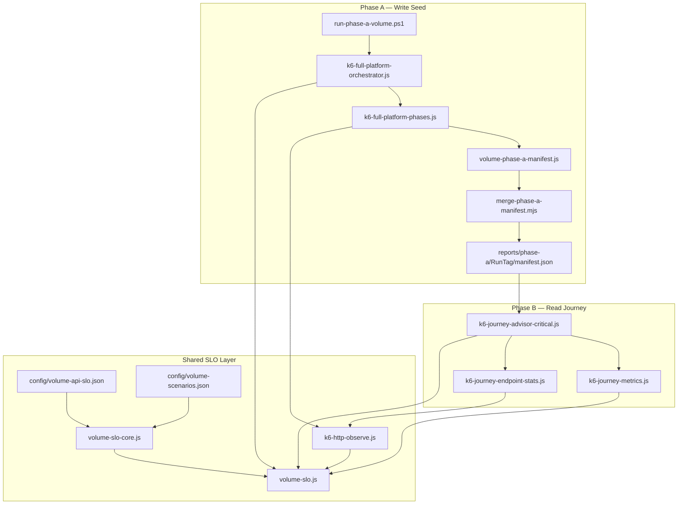

# Volume Testing Framework — Implementation Summary

Implementation-only delivery for Phase A (write seed) and Phase B (read journey) volume testing. **No k6 runners or load tests were executed during implementation.**

## Architecture



## File List

### Created

| File | Purpose |
|------|---------|
| `config/volume-scenarios.json` | Scenario profiles: write volume counts, read-only Phase B |
| `lib/volume-slo-core.js` | Pure SLO logic (budgets, violations, gate, scenarios) |
| `lib/volume-slo.js` | k6 metrics, env, Phase A/B report attachment |
| `lib/volume-manifest-core.js` | Pure manifest shard merge/validation |
| `lib/volume-phase-a-manifest.js` | k6 manifest shard store + Phase B loader |
| `tools/volume-slo.test.mjs` | 16 Node unit tests |
| `tools/merge-phase-a-manifest.mjs` | CLI merge + count validation |
| `runners/run-phase-a-volume.ps1` | Parallel advisor Phase A orchestration |
| `runners/run-phase-b-volume.ps1` | Phase B read journey runner |
| `runners/run-phase-a-cleanup.ps1` | Manifest-driven cleanup plan generator |
| `runners/scripts/Invoke-PhaseAAdvisorWorker.ps1` | Single-advisor k6 worker |
| `tools/generate-phase-a-summary.mjs` | Phase A summary.md generator |
| `tools/resolve-volume-scenario.mjs` | S1–S5 scenario resolution CLI |
| `docs/volume-testing-implementation.md` | This document |

### Modified

| File | Changes |
|------|---------|
| `config/volume-api-slo.json` | (pre-existing) read/write endpoint + step budgets |
| `lib/k6-http-observe.js` | Documents read/write SLO paths via `recordVolumeSloHttp` |
| `lib/k6-full-platform-phases.js` | Multi client/plan loops, manifest append, skip teardown |
| `lib/k6-journey-metrics.js` | SLO-aligned `lagBudgetMs`, `recordVolumeSloStep` on steps |
| `lib/k6-journey-endpoint-stats.js` | `observeHttp` read SLO, endpoint row `sloBudgetMs` |
| `k6/full-platform/k6-full-platform-orchestrator.js` | Manifest init/export, skip teardown, scenario logging |
| `k6/journeys/k6-journey-advisor-critical.js` | Manifest-driven targets, read-only, Phase B SLO reports |
| `docs/volume-slo.md` | (pre-existing) API reference |

## Phase Deliverables

### Phase 1 — Shared SLO Framework

- **Profiles:** `read` / `write` in `config/volume-api-slo.json`
- **Scenarios:** `config/volume-scenarios.json` with overrides
- **API:** `loadVolumeSloConfig`, `getEffectiveSloConfig`, `buildVolumeSloReport`, `evaluateVolumeSloGate`
- **Reports:** `volume-slo-summary`, `reports/phase-a/{RunId}/slo-summary.json`, `reports/phase-b/{RunId}/slo-summary.json`

### Phase 2 — Instrumentation

- **Metrics:** `slo_endpoint_violation_count`, `slo_endpoint_violation_rate`, `slo_step_violation_count`, `slo_step_violation_rate`
- **Write path:** `fullPlatformSloMeta` → endpoint + 8 phase step budgets
- **Read path:** `journeyReadSloMeta` + `recordVolumeSloStep` in journey metrics
- **`user_lag_rate`:** budgets sourced from same SLO step config when `VOLUME_SLO=1`

### Phase 3 — Phase A Infrastructure

- **`run-phase-a-volume.ps1`:** lease N advisors, parallel jobs, isolated `workers/` + `manifests/` dirs
- **`merge-phase-a-manifest.mjs`:** shard merge + optional `--expected-clients` / `--expected-plans`
- **`run-phase-a-cleanup.ps1`:** emits `cleanup-plan.json` from merged manifest (no traffic)
- **Env:** `FULL_PLATFORM_SKIP_TEARDOWN`, `PHASE_A_EXPORT_MANIFEST`, `PHASE_A_RUN_TAG`

### Phase 4 — Orchestrator Extensions

- **Loops:** `PHASE_A_CLIENTS_PER_ADVISOR`, `PHASE_A_PLANS_PER_CLIENT` (or scenario)
- **Manifest:** per-VU shard → `reports/phase-a/{RunTag}/manifests/shard-*.json`
- **Skip teardown:** `FULL_PLATFORM_SKIP_TEARDOWN` aliases `FULL_PLATFORM_SKIP_CLEANUP`
- **Backward compatible:** defaults remain 1 client / 1 plan / cleanup on

### Phase 5 — Journey Extensions

- **Manifest:** `PHASE_B_MANIFEST_FILE` / `VOLUME_MANIFEST_FILE` → `selectManifestTargetForVu`
- **Read-only:** `PHASE_B_READ_ONLY` / `VOLUME_READ_ONLY` skips seed + teardown mutations
- **Phase B report:** `attachPhaseBSloToSummary`, `buildPhaseBThresholds` when gate on

## Environment Variables

| Variable | Phase | Description |
|----------|-------|-------------|
| `VOLUME_SLO` | A/B | Enable SLO sampling (`1`) |
| `VOLUME_SLO_PROFILE` | A/B | `write` or `read` override |
| `VOLUME_SLO_FILE` | A/B | SLO config path (fallbacks for k6 cwd) |
| `VOLUME_SCENARIOS_FILE` | A/B | Scenarios JSON path |
| `VOLUME_SCENARIO` | A/B | Scenario key (e.g. `phase-a-write-volume`) |
| `VOLUME_SLO_GATE` | A/B | Enable k6 thresholds + gate in summary |
| `VOLUME_SLO_RUN_ID` | A/B | Report run id |
| `PHASE_A_RUN_TAG` | A | Run tag for manifest + SLO paths |
| `PHASE_A_EXPORT_MANIFEST` | A | Write manifest shards (`1`) |
| `PHASE_A_CLIENTS_PER_ADVISOR` | A | Clients per iteration |
| `PHASE_A_PLANS_PER_CLIENT` | A | Plans per client |
| `FULL_PLATFORM_SKIP_TEARDOWN` | A | Skip client/plan delete |
| `FULL_PLATFORM_SKIP_CLEANUP` | A | Alias for skip teardown |
| `PHASE_B_MANIFEST_FILE` | B | Merged manifest for read journey |
| `PHASE_B_READ_ONLY` | B | No seed/teardown mutations |
| `PHASE_B_RUN_TAG` | B | Phase B report path |
| `VOLUME_READ_ONLY` | B | Alias for read-only |

## Static Validation

- `node --test tools/volume-slo.test.mjs` — **16/16 pass**
- `node --check` on all modified k6 lib/script entry points — **pass**
- **Circular dependencies:** none (`volume-slo-core` ← `volume-manifest-core`; k6 layer imports core only)
- **Backward compatibility:** without `VOLUME_SLO`, behavior matches pre-volume scripts

## Unresolved Risks

1. **k6 `open()` path resolution:** default config paths resolve relative to script directory (`k6/full-platform/`). Fallback paths in `CONFIG_OPEN_FALLBACKS` / runner `-e VOLUME_SLO_FILE=../../config/...` mitigate; document cwd when invoking k6 directly.
2. **Orchestrator prerequisites:** still requires `lifecycle-users.json` or `USE_USER_POOL=1` + leased slice — unchanged.
3. **Phase A cleanup runner:** generates cleanup plan only; actual delete still requires k6 cleanup or manual pool tooling.
4. **Multi-plan SLO steps:** each plan records full step metric set; high plan counts increase sample volume for gate evaluation.
5. **Manifest VU mapping:** `selectManifestTargetForVu` uses advisor index modulo; pool VU order must align with Phase A advisor order for realistic pairing.
6. **PowerShell worker jobs:** `run-phase-a-volume.ps1` invokes k6 inside jobs — validate k6 PATH and secrets in target CI agents before first run.

## Recommended Smoke-Test Plan (Execution — Requires Approval)

**Do not run until explicitly approved.**

### Phase A smoke (1 advisor)

1. Lease 1 verified user: `pool-cli lease --count 1 --run-id smoke-a --env dev`
2. Single orchestrator run:
   ```powershell
   k6 run k6/full-platform/k6-full-platform-orchestrator.js `
     -e USE_USER_POOL=1 -e POOL_SLICE_FILE=data/user-pool/dev/pool-slice-smoke-a.json `
     -e VOLUME_SLO=1 -e VOLUME_SLO_PROFILE=write -e VOLUME_SLO_GATE=1 `
     -e PHASE_A_EXPORT_MANIFEST=1 -e PHASE_A_RUN_TAG=smoke-a `
     -e FULL_PLATFORM_SKIP_TEARDOWN=1 -e VUS=1 -e DURATION=1m `
     -e VOLUME_SLO_FILE=../../config/volume-api-slo.json `
     -e SIGNUP_ROPC_CLIENT_ID=k6-load-test-client -e SIGNUP_ROPC_CLIENT_SECRET=$env:STS_SECRET
   ```
3. Verify: `reports/phase-a/smoke-a/slo-summary.json`, manifest shard under `manifests/`
4. Merge: `node tools/merge-phase-a-manifest.mjs reports/phase-a/smoke-a/manifests --run-tag smoke-a`

### Phase B smoke (1 VU, manifest)

1. Run journey against merged manifest:
   ```powershell
   k6 run k6/journeys/k6-journey-advisor-critical.js `
     -e USE_USER_POOL=1 -e POOL_SLICE_FILE=... `
     -e VOLUME_SLO=1 -e VOLUME_SLO_PROFILE=read -e VOLUME_SLO_GATE=1 `
     -e PHASE_B_MANIFEST_FILE=reports/phase-a/smoke-a/manifest.json `
     -e PHASE_B_READ_ONLY=1 -e VUS=1 -e DURATION=2m `
     -e SIGNUP_ROPC_CLIENT_ID=k6-load-test-client -e SIGNUP_ROPC_CLIENT_SECRET=$env:STS_SECRET
   ```
2. Verify: `reports/phase-b/{RunId}/slo-summary.json`, `user_lag_rate` < 5%, no POST seed traffic

### Full volume runner smoke

```powershell
# Phase A — S1 smoke (2 advisors, fixed users, SLO gate)
.\runners\run-phase-a-volume.ps1 -Scenario S1 -RunId smoke-s1 -AdvisorCount 2 -UseFixedAdvisors -VolumeSloGate

# Phase B — after Phase A manifest exists
.\runners\run-phase-b-volume.ps1 -Scenario S1 -RunId smoke-s1-b -PhaseARunTag smoke-s1 -UseFixedAdvisors -VolumeSloGate
```

Legacy pool path (no `-UseFixedAdvisors`):

```powershell
.\runners\run-phase-a-volume.ps1 -Advisors 2 -VolumeScenario phase-a-write-default
```

Then Phase B with `-e PHASE_B_MANIFEST_FILE=reports/phase-a/{RunTag}/manifest.json`.

---

**Status:** Implementation complete. Awaiting explicit approval before any execution phase.
