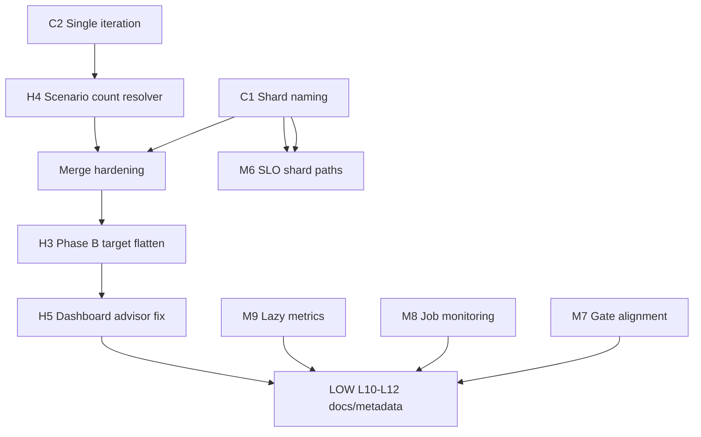

# Final Remediation Review — Volume Testing Framework

**Mode:** Code-only analysis. No k6, runners, pool-cli, provisioning, HTTP traffic, or code modifications were performed.

**Reference:** [`volume-testing-architecture-review.md`](volume-testing-architecture-review.md)

---

## 1. Executive Summary

Twelve defects were identified in the architecture review. This document maps each to exact code paths, proposes precise remediations, flags secondary risks from those fixes, and orders work by dependency.

**Current approval status:** **NOT APPROVED** for multi-advisor volume execution.

**Minimum remediation gate (Critical + High):**

| ID | Issue | Blocks |
|----|-------|--------|
| C1 | Manifest shard filename collision | Parallel Phase A |
| C2 | Unbounded k6 iterations per advisor | Count validation S1–S5 |
| H3 | Phase B uses only `clients[0].cashflows[0]` | Volume read coverage |
| H4 | Runner merge validation ignores scenario JSON | False-positive merge pass |
| H5 | Dashboard uses login advisor, not manifest advisor | Cross-advisor reads |

After Critical + High fixes, Medium items (SLO overwrite, gate semantics, job monitoring, metric registration) should be addressed before fleet-scale sign-off. Low items are documentation and observability improvements.

**Post-remediation guarantees (when implemented as specified):**

- Advisor → Client → Cashflow hierarchy preserved in manifest merge
- Phase B remains read-only for Ibernia API mutations when `PHASE_B_READ_ONLY=1` or manifest loaded
- Baseline runners unchanged when `VOLUME_SLO` is unset (with one minor exception: lazy-load refactor removes extra metric registration)

---

## 2. Defect-by-Defect Analysis

### CRITICAL C1 — Manifest shard collision

#### Current shard filename generation

```96:99:load-testing-k6/lib/volume-phase-a-manifest.js
export function resolvePhaseAManifestShardPath(runTag) {
  const tag = (runTag || phaseARunTag()).replace(/[^a-zA-Z0-9._-]/g, '_');
  const vu = getStore().vu != null ? String(getStore().vu) : 'vu';
  return `reports/phase-a/${tag}/manifests/shard-${tag}-${vu}.json`;
}
```

Shard is written in `attachPhaseAManifestShardToSummary()` (line 106–112). `vu` comes from `initPhaseAManifestShard()` → orchestrator passes `__VU` (line 470–474 in `k6-full-platform-orchestrator.js`).

#### Every read/merge path

| Location | Role |
|----------|------|
| `lib/volume-phase-a-manifest.js` | Writes shard via `handleSummary` |
| `runners/scripts/Invoke-PhaseAAdvisorWorker.ps1` L77–80 | Copies `reports/phase-a/{RunTag}/manifests/` → worker dir |
| `runners/run-phase-a-volume.ps1` L136–143 | Copies worker manifests → `manifestsRoot` with `-Force` |
| `tools/merge-phase-a-manifest.mjs` L37–47 | `readdirSync` + load all `*.json` |
| `lib/volume-manifest-core.js` | `mergePhaseAManifestShards()` |
| `lib/volume-phase-a-manifest.js` L119–128 | `loadPhaseBManifest()` (merged file, not shards) |

#### Root cause

Each Phase A worker sets `VUS=1` (`Invoke-PhaseAAdvisorWorker.ps1` L36). All workers produce `shard-{RunTag}-1.json`. Parallel k6 processes race on the same repo-root path; last writer wins. Copy-to-`manifestsRoot` also overwrites duplicates.

#### Recommended unique shard strategy

Introduce **`PHASE_A_SHARD_ID`** (worker-assigned, e.g. `advisor-00` … `advisor-19`):

```text
shard-{runTag}-{shardId}.json
```

Where `shardId` priority:

1. `__ENV.PHASE_A_SHARD_ID` (set by worker from `$userKey`)
2. Else sanitized `advisorSub` (first 12 chars of hash)
3. Else `vu-{vu}-iter-{iteration}` (fallback for direct k6 runs)

Store `shardId` on shard JSON: `{ ..., shardId: "advisor-00" }`.

Worker change: pass `-e PHASE_A_SHARD_ID=advisor-00` from `run-phase-a-volume.ps1` loop.

#### Impact on `merge-phase-a-manifest.mjs`

- **Minimal logic change:** Already loads all `*.json`; unique names prevent overwrite during collection.
- **Add:** Duplicate detection — if two shards share same `advisorSub`, warn or fail.
- **Add:** Optional `--expected-shards N` matching advisor count.
- **Unit test:** Two shards with different `shardId`, same `runTag` → merge `shardCount: 2`.

#### Hidden defects from this fix

- **Hash collision:** Sanitized `advisorSub`-only IDs could collide if hash truncated too aggressively → prefer explicit worker index.
- **Backward compatibility:** Direct single-advisor k6 runs without `PHASE_A_SHARD_ID` must still produce one shard (keep vu fallback).

---

### CRITICAL C2 — Multiple iteration risk

#### Current execution model

**Worker** (`Invoke-PhaseAAdvisorWorker.ps1`):

```31:40:load-testing-k6/runners/scripts/Invoke-PhaseAAdvisorWorker.ps1
  '-e', 'VUS=1',
  '-e', 'USER_COUNT=1',
  '-e', "DURATION=$Duration",
  '-e', 'LOAD_MODE=vus',
```

**Orchestrator** (`k6-full-platform-orchestrator.js`):

```306:317:load-testing-k6/k6/full-platform/k6-full-platform-orchestrator.js
  return {
    scenarios: {
      fp_orchestrator: {
        executor: 'constant-vus',
        vus: vuCount,
        duration: DURATION,
        gracefulStop: '30s',
      },
    },
```

#### Exact iteration behavior

- `constant-vus` + `duration` → default function runs **repeatedly** until duration elapses.
- Each iteration: new `uniqueTag` (`fp${vu}_g${gi}_${Date.now()}`), full `executeFullPlatformSequence()`.
- Manifest store **accumulates** clients across iterations in one process (`appendPhaseAManifestClient` pushes to same store).
- `initPhaseAManifestShard` runs each iteration but only resets `clients[]` on first init — actually `initPhaseAManifestShard` **clears** `store.clients = []` every iteration (line 53), but re-appends during each iteration's sequence. Final shard reflects **last iteration's clients only** if init clears each time — **wait**, init runs every iteration and clears clients array. Each iteration rebuilds clients from scratch in store; only last iteration's clients survive in shard if each iteration completes one full sequence.

Actually re-read initPhaseAManifestShard - it sets `store.clients = []` every call at start of each default function iteration. So each iteration overwrites the in-memory client list. But **API-side** clients from prior iterations remain (skip teardown). Shard only captures last iteration; **DB has clients from all iterations**.

#### Can one worker create multiple client/plan sets?

**Yes.** With `DURATION=5m` and ~0.2s think + ~30–60s per sequence, expect **many iterations** per advisor. Seeded entity count >> scenario table.

#### Recommended fix (exactly one execution per advisor)

**Option A (preferred for volume worker):** Worker sets:

```powershell
-e LOAD_MODE=shared
-e 'shared-iterations' via orchestrator
```

Or explicitly in worker:

```powershell
'-e', 'LOAD_MODE=shared-iterations'
# orchestrator already supports shared mode with iterations: iters
```

Better: add to worker:

```powershell
'-e', 'PHASE_A_SINGLE_EXECUTION=1'
```

Orchestrator `scenarioOptions()` when flag set:

```javascript
if (phaseASingleExecution()) {
  return {
    scenarios: {
      fp_orchestrator: {
        executor: 'shared-iterations',
        vus: 1,
        iterations: 1,
        maxDuration: '30m',
      },
    },
    thresholds: thr,
  };
}
```

**Option B:** Worker passes `-e DURATION=1s` — fragile, timing-dependent.

**Option C:** Guard at top of `default function`:

```javascript
if (phaseASingleExecution() && globalThis.__k6PhaseAExecuted) return;
globalThis.__k6PhaseAExecuted = true;
```

Recommend **Option A** in orchestrator + worker env; document for manual runs.

#### Hidden defects

- Changing default orchestrator behavior globally would break `run-full-platform.ps1` load tests → gate behind `PHASE_A_SINGLE_EXECUTION=1` only.
- Single iteration + multi-client loop still creates `clientsPerAdvisor × plansPerClient` per advisor — correct for S1–S5.
- Merge validation must use **iterations=1** in expected count formula.

---

### HIGH H3 — Manifest-driven Phase B selection

#### Current logic

```87:101:load-testing-k6/lib/volume-manifest-core.js
export function selectManifestTargetForVu(manifest, vu) {
  const idx = Math.max(0, (Number(vu) || 1) - 1) % manifest.advisors.length;
  const advisor = manifest.advisors[idx];
  const client = advisor.clients[0];
  const cf = client.cashflows[0];
  ...
}
```

Used in `k6-journey-advisor-critical.js` → `resolveManifestTarget()` → `seedClientAndCashflow()`.

#### How data should be distributed

For volume read testing, each VU should exercise **distinct** client/plan pairs where possible:

```text
Flat targets[] = flatten(manifest.advisors → clients → cashflows)
targetIndex = (vu - 1) % targets.length
```

Each target carries: `{ advisorSub, advisorEmail, clientId, cashflowId, planName, uniqueTag }`.

#### Proposed algorithm

Add to `volume-manifest-core.js`:

```javascript
export function flattenManifestTargets(manifest) {
  const targets = [];
  for (const advisor of manifest.advisors || []) {
    for (const client of advisor.clients || []) {
      for (const cf of client.cashflows || []) {
        targets.push({
          advisorSub: advisor.advisorSub,
          advisorEmail: advisor.advisorEmail,
          clientId: client.clientId,
          cashflowId: cf.cashflowId,
          planName: cf.planName,
          uniqueTag: client.uniqueTag,
        });
      }
    }
  }
  return targets;
}

export function selectManifestTargetForVu(manifest, vu) {
  const targets = flattenManifestTargets(manifest);
  if (!targets.length) return null;
  return targets[(Math.max(1, Number(vu)) - 1) % targets.length];
}
```

Optional: `PHASE_B_TARGET_STRATEGY=round-robin|sticky` (default round-robin).

#### Backward compatibility

- S1 (1 client, 1 plan, 20 advisors): 20 targets; VU1–20 map to advisors 1–20 — same as today.
- Multi-client scenarios: **behavior change** (intentional) — VUs spread across clients/plans instead of all hitting `[0][0]`.
- Non-manifest journey: unchanged (seed path).

#### Hidden defects

- Pool VU count < target count → multiple VUs share targets (acceptable for load, not isolation tests).
- Pool user must **own** manifest client or GET-by-id may 403 — requires Phase A pool users == Phase B pool users aligned by advisor index (document operational requirement).
- `planName` unused in journey today — optional future check on GET cashflow response.

---

### HIGH H4 — Scenario count validation

#### Is `volume-scenarios.json` used during validation?

| Layer | Uses scenario counts? |
|-------|----------------------|
| k6 `resolvePhaseAVolumeCounts()` | **Yes** — reads `clientsPerAdvisor` / `plansPerClient` from scenario when env unset |
| `run-phase-a-volume.ps1` L86–91 | **No** — only `-ClientsPerAdvisor` / `-PlansPerClient` CLI params |
| `merge-phase-a-manifest.mjs` | **No** — only `--expected-clients/plans` args from runner |
| Worker | Passes `VOLUME_SCENARIO` to k6 but not counts unless CLI params set |

#### Can merge validation pass incorrectly?

**Yes:**

1. **`expectedClients/plans` omitted** (`ClientsPerAdvisor=0`) → validation `passed: true` always (null expected).
2. **Wrong shard count** (collision) → merge sees 1 shard, totals too low, but if expected also omitted → pass.
3. **Scenario `phase-a-write-volume` (3×2×20)** with no CLI params → k6 creates 3×2 per iteration; merge doesn't validate against 120/120.

#### Recommended source of truth

**Single resolver** used by k6 and PowerShell:

1. Add `tools/resolve-volume-scenario.mjs` (Node, no k6):

   ```javascript
   // reads config/volume-scenarios.json + scenario name
   // returns { clientsPerAdvisor, plansPerClient, profile, ... }
   ```

2. `run-phase-a-volume.ps1` before merge:

   ```powershell
   $scenario = node tools/resolve-volume-scenario.mjs $VolumeScenario | ConvertFrom-Json
   $cpa = if ($ClientsPerAdvisor -gt 0) { $ClientsPerAdvisor } else { $scenario.clientsPerAdvisor }
   $ppc = if ($PlansPerClient -gt 0) { $PlansPerClient } else { $scenario.plansPerClient }
   $expectedClients = $Advisors * $cpa * $iterations  # iterations=1 after C2 fix
   $expectedPlans = $Advisors * $cpa * $ppc * $iterations
   ```

3. Pass counts into merge CLI; embed in merged manifest `validation.scenario` metadata.

#### Hidden defects

- Scenario file out of sync with env overrides → document precedence: **CLI > env > scenario > default 1×1**.

---

### HIGH H5 — Dashboard advisor mismatch

#### Identity flow (manifest-driven Phase B)

| Step | Advisor source | Code |
|------|----------------|------|
| Manifest target | `advisor.advisorSub` from manifest | `selectManifestTargetForVu` |
| Seed store | `manifestTarget.advisorSub` | `seedClientAndCashflow` L260–267 |
| Login | `resolveAdvisorSub(row.email, tokenSub)` from **pool user JWT** | `runLogin` L341 |
| Dashboard | **`login.advisorSub`** | `default function` L756 |
| Open client | `seed.clientId` (manifest) | L760 |
| Cashflow load | `seed.cashflowId` (manifest) | L764 |

#### Problem

Dashboard lists clients for **pool user's advisor**; open client uses **manifest clientId** which belongs to **manifest advisor** (Phase A seed user). If pool slice user ≠ manifest advisor (misaligned VU mapping or wrong manifest), cross-advisor read occurs.

#### Recommended fix

In `k6-journey-advisor-critical.js` `default function`:

```javascript
const advisorSubForReads =
  seed.fromManifest && seed.advisorSub ? seed.advisorSub : login.advisorSub;

if (!runDashboard(data.base, login.accessToken, advisorSubForReads)) return;
```

Optionally assert when manifest-driven:

```javascript
if (seed.fromManifest && seed.advisorSub !== login.advisorSub) {
  console.warn(`[${SCRIPT_TAG}] VU ${__VU}: pool advisor != manifest advisor; using manifest for reads.`);
}
```

Stronger fix for isolation: **lease pool users matching manifest `advisorEmail`** per VU (operational, not code-only).

#### Hidden defects

- Token may lack permission to read manifest advisor's clients if advisorSub doesn't match token claims → 403; need pool alignment in runner docs.
- Using manifest advisorSub for dashboard without verifying JWT authorization could mask authorization bugs — prefer matched pool users.

---

### MEDIUM M6 — SLO summary overwrite

#### Writers of `reports/phase-a/{RunTag}/slo-summary.json`

Only `attachPhaseASloToSummary()` → `resolvePhaseASloReportPath()`:

```525:529:load-testing-k6/lib/volume-slo.js
export function resolvePhaseASloReportPath(runId) {
  const safe = raw.replace(/[^a-zA-Z0-9._-]/g, '_');
  return `reports/phase-a/${safe}/slo-summary.json`;
}
```

Called from orchestrator `handleSummary` (all parallel workers share same `RunTag`).

#### Recommended aggregation model

Mirror manifest pattern:

```text
reports/phase-a/{RunTag}/slo-shards/slo-{shardId}.json
```

Add `tools/merge-phase-a-slo.mjs` OR extend merge manifest tool to optionally merge SLO summaries (fleet rollup: max p95, weighted violation rates).

Phase A runner collects shards from worker dirs into `slo-shards/` then merges to `slo-summary-fleet.json`.

#### Hidden defects

- Cross-process p95 aggregation is statistically approximate (not true global p95) — document as advisor-level + fleet approximation.
- k6 thresholds remain per-process; fleet gate is JSON-only unless re-run analysis tool.

---

### MEDIUM M7 — Endpoint p95 gate behavior

#### Current implementation

```668:708:load-testing-k6/lib/volume-slo-core.js
  const passed =
    failedSteps.length === 0 &&
    (!opts.failOnEndpointP95 || failedEndpoints.length === 0) &&
    !violationRateFailed;
```

`attachPhaseASloToSummary` calls gate **without** `failOnEndpointP95`:

```594:598:load-testing-k6/lib/volume-slo.js
    summary.gate = evaluateVolumeSloGate(summary, {
      phaseASteps: PHASE_A_STEP_METRICS,
      maxStepViolationRate: 0.05,
    });
```

k6 thresholds **do** include `slo_endpoint_violation_rate: ['rate<0.05']` when gate enabled.

#### Design alignment

| Check | k6 threshold | JSON gate |
|-------|--------------|-----------|
| Step p95 | Yes (phase metrics) | Yes (`failedSteps`) |
| Step violation rate | `slo_step_violation_rate` | Yes (`violationRateFailed`) |
| Endpoint violation rate | `slo_endpoint_violation_rate` | **No** |
| Endpoint p95 | No dedicated threshold | **No** (unless `failOnEndpointP95`) |

**Mismatch:** k6 can fail on endpoint violation rate while JSON gate passes if step p95s pass and step violation rate ≤ 5%.

#### Recommended fix

Either:

1. **Align JSON gate to k6:** add endpoint violation rate check from `summary.rates.endpointViolationRate`.
2. **Or align k6 to JSON:** remove endpoint rate from k6 thresholds if gate is step-only by design.
3. **Document** in `volume-slo.md` which is authoritative.

Recommend (1) + optional `failOnEndpointP95: true` for strict mode.

---

### MEDIUM M8 — Job failure detection

#### Current logic

```128:134:load-testing-k6/runners/run-phase-a-volume.ps1
  foreach ($r in $results) {
    if ($r.State -ne 'Completed' -or ($r.ChildJobs[0].JobStateInfo.Reason -ne $null)) {
      $failed += $r.Name
    }
    $exit = Receive-Job -Job $r -Keep
    if ($exit -ne 0 -and -not $ContinueOnError) { $failed += $r.Name }
  }
```

#### Issues

- `$r.ChildJobs[0].JobStateInfo.Reason -ne $null` — completed jobs may have non-null Reason; false positives.
- `Receive-Job` return value is worker `exit $code` — reliable when worker exits with k6 code.
- Duplicate `$failed +=` for same job possible (both conditions).
- `$ContinueOnError` passed to worker but **unused** in worker script.

#### Recommended fix

```powershell
foreach ($r in $results) {
  $exit = Receive-Job -Job $r -Wait -ErrorAction SilentlyContinue
  if ($r.State -eq 'Failed') { $failed += $r.Name; continue }
  if ($null -ne $exit -and [int]$exit -ne 0) {
    if (-not $ContinueOnError) { $failed += $r.Name }
  }
}
```

Remove erroneous `ChildJobs[0].JobStateInfo.Reason` check.

---

### MEDIUM M9 — SLO metric registration when `VOLUME_SLO=0`

#### Current behavior

`lib/volume-slo.js` registers at module load (lines 68–83):

- `volume_slo_duration_ms`, `volume_slo_violation_rate`
- `slo_endpoint_violation_count/rate`, `slo_step_violation_count/rate`
- Eight `PHASE_A_STEP_METRICS` Trends

`lib/k6-journey-metrics.js` line 9: **static import** of `./volume-slo.js` → journey always loads volume metrics.

#### Risk

- Extra metrics appear in k6 end-of-test summary for all journey runs.
- No threshold failures (thresholds not added unless gate on).
- Consolidated reporting unaffected (separate pipeline).

#### Recommended fix

**Lazy registration pattern:**

```javascript
// volume-slo.js
let metricsInitialized = false;
function ensureVolumeSloMetrics() {
  if (metricsInitialized || !isVolumeSloEnabled()) return;
  metricsInitialized = true;
  // create Trend/Counter instances
}
```

Call `ensureVolumeSloMetrics()` at start of `recordVolumeSloHttp` / `recordVolumeSloStep`.

**Alternative:** split `volume-slo-k6.js` (metrics) from `volume-slo-env.js`; journey imports only env helpers when needed.

**journey-metrics:** replace static import with dynamic check:

```javascript
function recordVolumeSloStepIfEnabled(...) {
  if (!isVolumeSloEnabled()) return;
  // import or call through thin facade
}
```

#### Hidden defect

k6 requires metrics registered before init phase ends — lazy init must happen on first VU iteration before samples, not in `handleSummary`.

---

### LOW L10 — Failed client manifest handling

#### Current behavior

```350:353:load-testing-k6/lib/k6-full-platform-phases.js
    if (!clientId || !modelRaw) {
      ...
      continue;  // no manifest row
    }
```

```410:414:load-testing-k6/lib/k6-full-platform-phases.js
    if (clientId && cashflows.length) {
      appendPhaseAManifestClient(manifestRow);
    }
```

Failed clients omitted entirely.

#### Recommendation

Include stub entries for audit:

```javascript
appendPhaseAManifestClient({
  clientId: clientId || '',
  uniqueTag: clientTag,
  cashflows: [],
  error: 'client_create_failed' | 'partial_plan_failure',
});
```

Merge validation: add `validation.failedClients` count; optional `--allow-partial` flag.

**Validation counts:** exclude failed stubs from `totals.clients/plans` unless `--include-failed-in-count`.

---

### LOW L11 — Cleanup runner documentation

#### Documented behavior (`run-phase-a-cleanup.ps1` synopsis)

> "Deletes clients by last-name needle per advisor"

#### Actual behavior

Lines 51–82: **writes `cleanup-plan.json` only** — no delete, no k6, no pool-cli.

#### Remediation

Update synopsis and `volume-testing-implementation.md` to state: **plan generator only**. Rename optional: `run-phase-a-cleanup-plan.ps1` to avoid confusion.

---

### LOW L12 — Phase B run tag generation

#### Current code

```94:96:load-testing-k6/k6/journeys/k6-journey-advisor-critical.js
const PHASE_B_RUN_TAG = (
  (__ENV.PHASE_B_RUN_TAG || __ENV.VOLUME_SLO_RUN_ID || '').trim() || `phase-b-${Date.now()}`
);
```

Evaluated at **script init** (once per k6 process). Single process → one tag (OK).

#### Collision risk

- Concurrent separate k6 processes started same ms → unlikely collision on timestamp.
- Same `PHASE_B_RUN_TAG` env across concurrent journeys → **overwrite** `reports/phase-b/{RunId}/slo-summary.json`.

#### Recommended fix

Default in `setup()`:

```javascript
phaseBRunTag: __ENV.PHASE_B_RUN_TAG || `phase-b-${Date.now()}-vu${__ENV.K6_VUS || 'x'}`
```

Or require explicit `PHASE_B_RUN_TAG` in runner docs for CI.

---

## 3. Exact Files Affected (Remediation Touch List)

| File | Defects |
|------|---------|
| `lib/volume-phase-a-manifest.js` | C1, L10 |
| `lib/volume-manifest-core.js` | H3, H4, C1 (duplicate detect) |
| `k6/full-platform/k6-full-platform-orchestrator.js` | C2, C1 (shard ctx) |
| `runners/scripts/Invoke-PhaseAAdvisorWorker.ps1` | C1, C2 |
| `runners/run-phase-a-volume.ps1` | C1, H4, M8 |
| `tools/merge-phase-a-manifest.mjs` | C1, H4 |
| `tools/resolve-volume-scenario.mjs` | H4 (new) |
| `k6/journeys/k6-journey-advisor-critical.js` | H3, H5, L12 |
| `lib/volume-slo.js` | M6, M7, M9 |
| `lib/volume-slo-core.js` | M7 |
| `lib/k6-journey-metrics.js` | M9 |
| `lib/k6-full-platform-phases.js` | L10 |
| `runners/run-phase-a-cleanup.ps1` | L11 (docs only) |
| `docs/volume-slo.md`, `docs/volume-testing-implementation.md` | M7, L11 |
| `tools/volume-slo.test.mjs` | H3, C1, H4 (new cases) |
| `tools/merge-phase-a-slo.mjs` | M6 (new, optional) |

---

## 4. Recommended Code Changes (Summary)

| ID | Change |
|----|--------|
| C1 | Add `PHASE_A_SHARD_ID`; filename `shard-{tag}-{shardId}.json`; worker passes advisor index; merge duplicate detection |
| C2 | Add `PHASE_A_SINGLE_EXECUTION=1` → `shared-iterations`, `iterations: 1`; worker sets flag |
| H3 | `flattenManifestTargets()` + modulo VU selection over flat list |
| H4 | New `resolve-volume-scenario.mjs`; runner computes expected counts; merge always validates for volume runs |
| H5 | Dashboard uses `seed.advisorSub` when `seed.fromManifest` |
| M6 | Per-shard SLO path `slo-shards/slo-{shardId}.json`; optional fleet merge tool |
| M7 | Add `endpointViolationRate` to JSON gate; document k6 vs JSON authority |
| M8 | Fix job failure loop; remove `ChildJobs` Reason check |
| M9 | Lazy metric registration gated on `VOLUME_SLO=1` |
| L10 | Optional failed-client stubs with `error` field |
| L11 | Fix cleanup runner documentation |
| L12 | Move default Phase B run tag to `setup()` or require explicit env |

---

## 5. Dependency Order



**Implementation phases:**

1. **Phase R1 (blocking):** C1 + C2 (parallelizable)
2. **Phase R2 (validation):** H4 + merge hardening (depends R1)
3. **Phase R3 (Phase B):** H3 + H5 (depends R1 merge stable)
4. **Phase R4 (observability):** M6, M7, M8 (M6 depends C1)
5. **Phase R5 (polish):** M9, L10–L12 + unit tests

---

## 6. Risk Matrix

| ID | Severity | Probability | Impact | Priority |
|----|----------|-------------|--------|----------|
| C1 Shard collision | Critical | Certain (parallel) | Wrong manifest; data loss | **P0** |
| C2 Multi-iteration | Critical | Certain (duration>1 iter) | Counts 10–100× expected | **P0** |
| H3 First-client-only | High | Certain (volume) | 95%+ seeded data unread | **P1** |
| H4 Validation bypass | High | Likely | False pass on merge | **P1** |
| H5 Advisor mismatch | High | Possible | Cross-advisor read / 403 | **P1** |
| M6 SLO overwrite | Medium | Certain (parallel) | Wrong gate decision | **P2** |
| M7 Gate mismatch | Medium | Likely | k6 fail vs JSON pass | **P2** |
| M8 Job detection | Medium | Possible | Silent partial failure | **P2** |
| M9 Metric noise | Medium | Certain | Legacy report clutter | **P3** |
| L10 Failed clients | Low | Possible | Incomplete audit trail | **P3** |
| L11 Cleanup docs | Low | Certain | Operator confusion | **P4** |
| L12 Phase B tag | Low | Unlikely | Report overwrite | **P3** |

---

## 7. Expected Totals Recalculation (20 advisors, 1 iteration each)

Formula (after C2 fix):

```text
TotalClients = Advisors × ClientsPerAdvisor × Iterations
TotalPlans   = Advisors × ClientsPerAdvisor × PlansPerClient × Iterations
Iterations   = 1
Advisors     = 20
```

| Scenario | Clients/Adv | Plans/Client | Total Clients | Total Plans |
|----------|-------------|--------------|---------------|-------------|
| **S1** | 1 | 1 | **20** | **20** |
| **S2** | 5 | 2 | **100** | **200** |
| **S3** | 10 | 4 | **200** | **800** |
| **S4** | 20 | 8 | **400** | **3200** |
| **S5** | 30 | 8 | **600** | **4800** |

Per-advisor (single iteration):

| Scenario | Clients | Plans |
|----------|---------|-------|
| S1 | 1 | 1 |
| S2 | 5 | 10 |
| S3 | 10 | 40 |
| S4 | 20 | 160 |
| S5 | 30 | 240 |

**Without C2 fix:** multiply per-advisor columns by actual iteration count (unbounded).

---

## 8. Post-Remediation Verification Checklist (Static / Non-Traffic)

After code changes, before any execution approval:

- [ ] Unit: two shards unique `shardId` → merge `shardCount: 2`, totals sum correctly
- [ ] Unit: `flattenManifestTargets` covers all clients/plans for S5 shape
- [ ] Unit: `resolve-volume-scenario.mjs` returns counts for `phase-a-write-volume`
- [ ] Unit: gate fails when `endpointViolationRate > 0.05` (if M7 applied)
- [ ] Static: `node --check` all touched k6 entry points
- [ ] Static: no `&&` in new `.ps1` scripts; remain `#Requires -Version 5.1`
- [ ] Review: hierarchy `advisors[].clients[].cashflows[]` unchanged in merge output
- [ ] Review: journey seed path still blocked when `PHASE_B_READ_ONLY=1`
- [ ] Review: `run-full-platform.ps1` unchanged behavior without new env vars
- [ ] Review: baseline runners unmodified

---

## 9. Final Approval Status

| Gate | Status |
|------|--------|
| Architecture review complete | ✅ |
| Remediation plan complete | ✅ |
| Code fixes implemented | ❌ Not started (awaiting explicit instruction) |
| Critical defects resolved | ❌ |
| High defects resolved | ❌ |
| Static tests updated | ❌ |
| Execution approval | ❌ **NOT APPROVED** |

**Recommendation:** Implement Phase R1 (C1 + C2) first, then static unit tests, then Phase R2–R3 before any dev-environment volume run. Do not run `run-phase-a-volume.ps1` until P0 items are merged.

---

*Document generated from static code analysis. No tests, runners, or network traffic were executed.*
