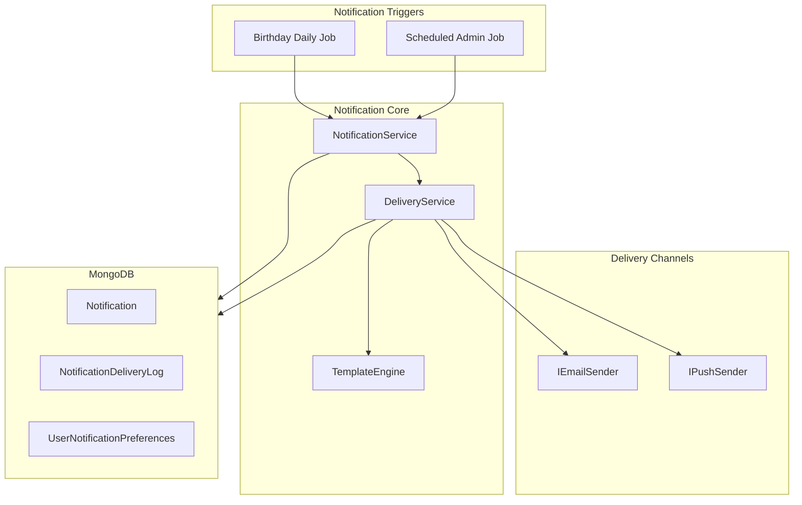

# Ibernia Notification System - Push and Email

## Architecture Overview




---

## 1. Database Schema (MongoDB)

### New Collections

**Notification** (admin-created news/updates)

- `Id`, `Title`, `MessageBody`, `DeliveryChannels` (push, email, both)
- `AudienceType` (AllUsers, SelectedUsers), `SelectedUserIds` (when SelectedUsers)
- `Status` (Draft, Scheduled, Sent)
- `PublishAt` (DateTime), `ExpiresAt` (DateTime?)
- `CreatedBy` (userId), `CreatedAt`, `SentAt`
- `DeepLinkRoute` (e.g. `/clients` or `/clients/123`)
- `TemplateKey` (optional, for i18n)

**NotificationDeliveryLog** (per-recipient delivery record)

- `Id`, `NotificationId`, `RecipientUserId`, `Channel` (Email, Push)
- `Status` (Queued, Sent, Delivered, Failed, Opened)
- `IdempotencyKey` (unique, prevents duplicates)
- `QueuedAt`, `SentAt`, `FailedAt`, `ErrorMessage`
- `RetryCount`

**UserNotificationPreferences** (or extend `UserProfile.Preferences`)

- `UserId`, `EmailNewsUpdates` (bool), `EmailBirthdays` (bool)
- `PushNewsUpdates` (bool), `PushBirthdays` (bool)

**BirthdayNotificationSent** (idempotency for birthday notifications)

- `Id`, `AdvisorId`, `ClientId`, `PersonType` (Client, Partner), `Date` (yyyy-MM-dd)
- Composite unique index on (AdvisorId, ClientId, PersonType, Date)

### Extend UserProfile

Add to `DefaultPrefrences` in [UserProfile.cs](backend/Services/IberniaManager/Ibernia.Api/Entities/UserProfile.cs):

- `TimeZone` (string, e.g. "Europe/Dublin", default "UTC")
- `NotificationPreferences` (nested object with EmailNewsUpdates, EmailBirthdays, PushNewsUpdates, PushBirthdays)

---

## 2. User Notification Preferences

### Backend

- Extend `UserProfileModel` and `DefaultPrefrences` with notification prefs and timezone
- Add `PATCH /api/v1/userprofile/{userId}/notification-preferences` endpoint
- Add `PATCH /api/v1/userprofile/{userId}/timezone` endpoint (or include in preferences)

### Frontend

- Wire existing [notifications.component.html](frontend/src/app/settings/notifications/notifications.component.html) toggles to the new API
- Load/save preferences via `UserProfileService` or new `NotificationPreferencesService`
- Map `toggleStatus`/`toggleStatus1` to EmailNewsUpdates/EmailBirthdays, `toggleStatus2`/`toggleStatus3` to PushNewsUpdates/PushBirthdays

---

## 3. Birthday Notifications

### Logic

- **Trigger**: Daily `BirthdayNotificationHostedService` (similar to [DataRetentionHostedService](backend/Services/IberniaManager/Ibernia.Api/Services/DataRetention/DataRetentionHostedService.cs))
- **Query**: All `Client` where `DeletedAt == null`, with `ClientDetails.BirthDate` or `PartnerDetail.BirthDate` set
- **Timezone**: For each client, get advisor's `UserProfile.Preferences.TimeZone`; convert "today" to that timezone and compare month/day
- **Deduplication**: Before sending, check `BirthdayNotificationSent` for (AdvisorId, ClientId, PersonType, Date). If exists, skip.
- **Copy**:
  - Client: "Today is {FirstName} {LastName}'s birthday. Wish them a happy birthday!"
  - Partner: "Today is {PartnerFirstName} {PartnerLastName}'s birthday, partner of {ClientFirstName} {ClientLastName}. Wish them a happy birthday!"
- **Channels**: Respect user preferences; send to advisor's email and/or push
- **Idempotency**: Insert into `BirthdayNotificationSent` before sending (or use transactional pattern)

### Template

- Store template keys in i18n JSON ([en.json](frontend/src/assets/i18n/en.json), [it.json](frontend/src/assets/i18n/it.json))
- Backend: Add notification template JSON files (e.g. `Notifications/en.json`) or store in DB; resolve by `UserProfile.Preferences.Language`

---

## 4. Admin News/Updates Notifications

### API Endpoints (Ibernia API)

- Protected by `[Authorize(Roles = "Administrator")]` for JWT, **or** by API key (`X-Admin-Api-Key`) for Identity Admin server-to-server calls


| Method | Route                                         | Purpose                                              |
| ------ | --------------------------------------------- | ---------------------------------------------------- |
| GET    | `/api/v1/admin/notifications`                 | List notifications (filter by status)                |
| GET    | `/api/v1/admin/notifications/{id}`            | Get single notification                              |
| POST   | `/api/v1/admin/notifications`                 | Create (Draft)                                       |
| PUT    | `/api/v1/admin/notifications/{id}`            | Update (Draft/Scheduled)                             |
| DELETE | `/api/v1/admin/notifications/{id}`            | Delete (Draft only)                                  |
| POST   | `/api/v1/admin/notifications/{id}/publish`    | Publish now (Draft → Sent)                           |
| GET    | `/api/v1/admin/notifications/{id}/deliveries` | Delivery status per recipient                        |
| GET    | `/api/v1/admin/users`                         | List users for audience selection (from UserProfile) |


### Notification Model (Create/Update)

```json
{
  "title": "string",
  "messageBody": "string",
  "deliveryChannels": ["push", "email"],
  "audienceType": "AllUsers" | "SelectedUsers",
  "selectedUserIds": ["id1", "id2"],
  "publishAt": "2025-03-15T09:00:00Z",
  "expiresAt": "2025-03-20T23:59:59Z",
  "deepLinkRoute": "/clients",
  "templateKey": "news.generic"
}
```

### Scheduler Job

- `ScheduledNotificationHostedService`: runs every 5–15 minutes
- Query `Notification` where `Status == Scheduled` and `PublishAt <= Now` (in server time or per-user timezone for "send at 9am local")
- For timezone-aware send: group by user timezone, send when it's "publish time" in that timezone
- Create `NotificationDeliveryLog` per recipient; set Status = Queued
- Process queue: send via email/push, update status, retry on failure

### Audit Trail

- `CreatedBy` from JWT `sub` claim
- `CreatedAt`, `SentAt` on Notification
- Full delivery log in `NotificationDeliveryLog`

---

## 5. Delivery Status, Retry, Deduplication

### Status Flow

`Queued` → `Sent` (submitted to provider) → `Delivered` / `Failed` / `Opened` (if provider supports)

### Idempotency

- **Birthday**: `BirthdayNotificationSent` collection with unique (AdvisorId, ClientId, PersonType, Date)
- **Admin**: `NotificationDeliveryLog.IdempotencyKey` = `{NotificationId}:{UserId}:{Channel}`; unique index prevents duplicate sends on retry

### Retry Logic

- On transient failure (e.g. 5xx, rate limit): exponential backoff, max 3 retries
- Mark `Failed` after max retries; log `ErrorMessage`

---

## 6. Templates and i18n

### Email Templates

- Use a simple template engine (e.g. Scriban, Handlebars.NET, or Razor Light)
- Template files: `Templates/Email/birthday-client.html`, `birthday-partner.html`, `news-generic.html`
- Placeholders: `{{PersonName}}`, `{{ClientName}}`, `{{Title}}`, `{{MessageBody}}`, `{{DeepLink}}`
- Resolve language from `UserProfile.Preferences.Language` (default "en")

### Push Templates

- JSON structure: `{ "title": "{{Title}}", "body": "{{MessageBody}}", "data": { "route": "{{DeepLink}}" } }`
- Same placeholder substitution

### Translation Keys

- Add keys to `frontend/src/assets/i18n/en.json` and `it.json` for notification copy
- Backend loads equivalent JSON for server-rendered content

---

## 7. Push Notifications

### Option A: Firebase Cloud Messaging (FCM)

- Add `FirebaseAdmin` NuGet; use FCM HTTP v1 API
- Store `PushSubscription` per user: `UserId`, `Endpoint`, `Keys` (p256dh, auth)
- Frontend: `@angular/fire` or `firebase` SDK; request permission, subscribe, send token to API
- API: `POST /api/v1/userprofile/{userId}/push-subscription` to register device

### Option B: Defer Push

- Implement email first; add `IPushSender` interface with no-op implementation
- Add push subscription storage and API; implement FCM/OneSignal in phase 2

### Deep Links

- Push payload: `{ "data": { "route": "/clients" } }` or `{ "route": "/clients/abc123" }`
- Angular: handle in service worker or app init; `Router.navigateByUrl(payload.route)`

---

## 8. Admin UI (Identity Admin)

### Location

- Add notification management to the existing **Identity Server Admin** ([identity/src/Ibernia.IdentityServer.Admin.UI](identity/src/Ibernia.IdentityServer.Admin.UI))
- Uses the same Razor/MVC pattern as Configuration, Identity, Log, etc.
- Already protected by `AdministrationPolicy` (IberniaIdentityAdminAdministrator role)

### Integration with Ibernia API

- Notification data lives in **MongoDB** (Ibernia API); Identity Admin uses **PostgreSQL**
- Identity Admin controllers call the **Ibernia API** via HTTP for notification CRUD
- Auth: Configure `IberniaApiBaseUrl` and `IberniaAdminApiKey` in Identity Admin appsettings; Ibernia API admin endpoints accept `X-Admin-Api-Key` header for server-to-server calls (or use client credentials if preferred)

### New Menu and Pages

- Add dropdown "Notifications" to [Layout.cshtml](identity/src/Ibernia.IdentityServer.Admin.UI/Areas/AdminUI/Views/Shared/_Layout.cshtml) (alongside Configuration, User management, Logs)
- **List** (`/Notifications`): Table of notifications (title, status, publish date, created by, actions)
- **Create/Edit** (`/Notifications/Notification`): Form for title, message, channels, audience, publish date, expiry, deep link
- **Delivery status** (`/Notifications/Deliveries/{id}`): View delivery log per notification

### Implementation

- New `NotificationController` in Identity Admin UI
- `IIberniaNotificationApiClient` (or similar) that uses `IHttpClientFactory` to call Ibernia API
- Views follow existing patterns (e.g. [IdentityProvider](identity/src/Ibernia.IdentityServer.Admin.UI/Areas/AdminUI/Views/IdentityProvider/))

---

## 9. Timezone Logic

### Storage

- Store `TimeZone` in `UserProfile.Preferences` (IANA, e.g. "Europe/Dublin")
- Default: "UTC" if not set

### Birthday Check

- For advisor in "Europe/Dublin": get `DateTimeOffset.Now` in that zone; extract date
- Compare `client.ClientDetails.BirthDate.Month` and `.Day` with that local date
- Use `TimeZoneInfo.FindSystemTimeZoneById` or NodaTime

### Scheduled Notifications

- Option 1: `PublishAt` in UTC; send immediately when `PublishAt <= UtcNow`
- Option 2: "Send at 9am local" per user: store preferred send time; for each user, check if it's 9am in their timezone, then send

---

## 10. File Structure

### Backend (Ibernia.Api)

```
Entities/
  Notification.cs
  NotificationDeliveryLog.cs
  BirthdayNotificationSent.cs
  PushSubscription.cs (optional, phase 2)

Models/
  NotificationModel.cs
  NotificationDeliveryLogModel.cs
  CreateNotificationRequest.cs

Services/
  Notifications/
    INotificationService.cs
    NotificationService.cs
    IBirthdayNotificationService.cs
    BirthdayNotificationService.cs
    IDeliveryService.cs
    DeliveryService.cs
    ITemplateService.cs
    TemplateService.cs
    IPushSender.cs (interface + no-op impl)

Services/
  Notifications/
    BirthdayNotificationHostedService.cs
    ScheduledNotificationHostedService.cs

Controllers/
  Admin/
    NotificationsController.cs

Templates/
  Email/
    birthday-client.html
    birthday-partner.html
    news-generic.html
```

### Frontend (Ibernia Angular app – settings only)

```
app/
  settings/
    notifications/
      notifications.component.ts (wire toggles to API)
  services/
    notification-preferences.service.ts
```

### Identity Admin UI (Razor/MVC)

```
Areas/AdminUI/
  Controllers/
    NotificationController.cs
  Views/
    Notification/
      Notifications.cshtml (list)
      Notification.cshtml (create/edit)
      NotificationDelete.cshtml
      Deliveries.cshtml (delivery status)
  Services/
    IIberniaNotificationApiClient.cs
    IberniaNotificationApiClient.cs
```

---

## 11. Implementation Order

1. **Phase 1 – Foundation**
  - Add `Notification`, `NotificationDeliveryLog`, `BirthdayNotificationSent` entities
  - Extend `UserProfile` with `TimeZone` and `NotificationPreferences`
  - API for notification preferences + timezone
  - Wire frontend notification toggles to API
2. **Phase 2 – Birthday**
  - `BirthdayNotificationService` + `BirthdayNotificationHostedService`
  - Email templates and `TemplateService`
  - Idempotency and timezone logic
3. **Phase 3 – Admin API**
  - Admin CRUD endpoints
  - `ScheduledNotificationHostedService`
  - Delivery logging and retry
4. **Phase 4 – Admin UI**
  - Identity Admin: `NotificationController`, `IberniaNotificationApiClient`
  - Razor views: list, create/edit, delivery status
  - Menu item and API key config
5. **Phase 5 – Push**
  - `IPushSender`, FCM integration
  - Push subscription API and frontend registration
  - Deep link handling

---

## 12. Key Decisions to Confirm


| Topic                       | Recommendation                                                      |
| --------------------------- | ------------------------------------------------------------------- |
| Admin UI location           | Identity Admin (Razor/MVC) – calls Ibernia API via HTTP + API key   |
| Push provider               | Firebase or defer to phase 2                                        |
| Timezone for scheduled send | Start with UTC `PublishAt`; add "send at 9am local" later if needed |
| Template engine             | Scriban or Handlebars.NET for flexibility                           |


