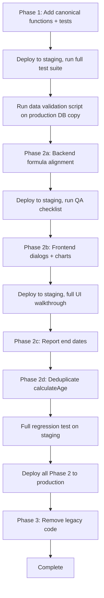

# Unified Age, Plan End & Simulation Boundary Design

## 1. Executive Summary

Ibernia currently calculates plan end year with **three different formulas** and age with **two different strategies**, causing the reported "age 89 in year 2080" bug and potential off-by-one errors in projection data. This plan introduces a **single canonical definition** for each concept, migrates all callsites in three safe phases, and preserves backward compatibility with existing persisted data.

---

## 2. Canonical Rules (The Single Source of Truth)

### 2A. Plan End Year

**Decision: `birthYear + planDuration` (Option B — end-of-calendar-year semantics)**

```
planEndCalendarYear = birthDate.getFullYear() + Math.trunc(planDuration)
planEndDate         = Dec 31 of planEndCalendarYear, 12:00:00 UTC
```

**Justification:**
- Already used in **8 out of 10** calculation sites (frontend standard, timeline creation, reports, edit-model dialog)
- Simpler to reason about: "plan to age 90, born 1990 → plan ends 2080"
- Deterministic — does not depend on forecast start date (which can change)
- The backend formula `forecastStartYear + (planDuration - ageAtForecastStart)` is mathematically intended to produce the same result, but drifts by +1 when the client's birthday falls after the forecast start date — this is the bug, not a feature
- Financial planning convention: yearly projections align to calendar years; using end-of-year avoids mid-year ambiguity

**What changes:** Backend `CashflowService.cs` `GetPlanEndCalendarYear` (lines 489-503) must be rewritten to use `birthYear + planDuration`.

### 2B. Age Calculation

**Decision: Completed years at reference date (month/day aware) — always**

```
age(birthDate, referenceDate) =
  let age = referenceDate.year - birthDate.year
  if birthday has NOT yet occurred in referenceDate's year:
    age = age - 1
  return age
```

**Reference date conventions:**
- "Age at a specific moment" (profile, event placement) → use the actual date
- "Age label for projection column / chart axis year Y" → use `age(birthDate, forecastStartDate) + (Y - forecastStartYear)` for intermediate years, and `age(birthDate, Dec 31 of Y)` for the terminal year — this is the existing `getProjectionColumnAgeLabel` logic, which is correct **when planDuration is supplied**
- "Persisted age on an AgeYear record" → `age(birthDate, Jan 1 of year)` — represents "how old is the client during this calendar year" (see Section 4 on backward compatibility)

**What changes:**
- Timeline drag/drop in `timeline-chart.component.ts` (lines 458, 1136, 1142): replace `year - birthYear` with the canonical age function
- Backend `PlanEndLabelAge` in `CashflowService.cs` (line 508): replace `planEndCalendarYear - birthDate.Year` with `AgeAtDate(birthDate, new DateTime(planEndCalendarYear, 12, 31))`
- All callers of `getProjectionColumnAgeLabel` / `getPersistedAgeForCalendarYear` must always pass `planDuration` — no more optional omission

### 2C. Simulation Boundary

**Decision: Year-integer loops, inclusive of planEndCalendarYear**

```
for (int year = forecastStartYear; year <= planEndCalendarYear; year++)
```

**This is already the pattern** in `FinancialCalculationEngine.ProcessCalculations` and `CalculateYearlyAmounts`. The key change is ensuring `planEndCalendarYear` fed into these loops comes from the unified formula, not from a `forecastEndDate.Year` that was set by a different formula.

---

## 3. Architecture Design — Central Module

### 3A. Frontend: Extend existing `client-age-at-reference.ts`

This file already contains the core utilities. The plan is to **add explicit facade functions** and **deprecate direct year arithmetic** elsewhere.

```typescript
// --- Existing (keep) ---
export function getCompletedYearsAgeAtDate(birthDate, referenceDate): number
export function getPlanEndCalendarYear(birthDate, planDuration): number | null
export function getProjectionColumnAgeLabel(birthDate, calendarYear, forecastStartDate, planDuration, projectionInclusiveEndYear?): number
export function getPersistedAgeForCalendarYear(birthDate, calendarYear, forecastStartDate, planDuration, projectionInclusiveEndYear?): number

// --- New (add) ---

/** Canonical plan end date: Dec 31 of planEndCalendarYear, 12:00 UTC */
export function getPlanEndDate(
  birthDate: Date | string | null | undefined,
  planDuration: number | null | undefined,
): Date | null

/** Age during a calendar year (completed years at Jan 1) — for persisted AgeYear.age */
export function getAgeInCalendarYear(
  birthDate: Date | string,
  calendarYear: number,
): number

/** Full list of projection calendar years [forecastStartYear .. planEndYear] inclusive */
export function getProjectionYears(
  forecastStartDate: Date | string,
  birthDate: Date | string,
  planDuration: number,
): number[]
```

All dialog components, charts, and reports import from this single file.

### 3B. Backend: Centralize in `Helper.cs`

```csharp
// --- Existing (keep) ---
public static int CalculateAge(this DateTime dateOfBirth)           // age at today
public static int AgeAtDate(this DateTime dateOfBirth, DateTime at) // age at any date

// --- New (add) ---

/// Canonical plan end calendar year: birthYear + planDuration
public static int GetPlanEndCalendarYear(DateTime birthDate, int planDuration)
    => birthDate.Year + planDuration;

/// Canonical plan end date: Dec 31 of plan end year, noon UTC
public static DateTime GetPlanEndDate(DateTime birthDate, int planDuration)
    => new DateTime(birthDate.Year + planDuration, 12, 31, 12, 0, 0, DateTimeKind.Utc);

/// Age label for a plan end year (completed years at Dec 31 of that year)
public static int PlanEndAge(DateTime birthDate, int planEndCalendarYear)
    => birthDate.AgeAtDate(new DateTime(planEndCalendarYear, 12, 31));

/// Projection year range [forecastStartYear .. planEndYear]
public static IEnumerable<int> GetProjectionYears(DateTime forecastStart, DateTime birthDate, int planDuration)
{
    var endYear = GetPlanEndCalendarYear(birthDate, planDuration);
    for (int y = forecastStart.Year; y <= endYear; y++) yield return y;
}
```

`CashflowService.GetPlanEndCalendarYear` (private, divergent formula) and `PlanEndLabelAge` both become thin wrappers that call `Helper.GetPlanEndCalendarYear` / `Helper.PlanEndAge`.

### 3C. Cross-Stack Contract

There is no shared codegen (no OpenAPI artifact in-repo). The contract between frontend and backend is the `AgeYear` shape:

```
Backend: AgeYear { int Age, int Year }   (C# class, ClientEvent.cs)
Frontend: AgeYear { age: number, year: number }  (TS interface, financial-timeline.ts)
```

**Rule:** `Year` is always the calendar year. `Age` is always `getAgeInCalendarYear(birthDate, year)` = completed years at Jan 1 of that year. Backend and frontend must agree on this definition. The projection engine uses `Year` as the loop variable; `Age` is a display/label field only.

---

## 4. Migration Strategy (Three Phases)

### Phase 1: Introduce Canonical Functions (No Behavior Change)

**Goal:** Add new functions alongside existing ones. Ship to production. Verify no regressions.

**Backend changes:**
- Add `GetPlanEndCalendarYear(DateTime, int)`, `GetPlanEndDate`, `PlanEndAge`, `GetProjectionYears` to `Helper.cs`
- Add unit tests in a new test class `Helpers/PlanHorizonHelperTests.cs` in the test project
- Risk: **Low** — additive only, no existing code touched

**Frontend changes:**
- Add `getPlanEndDate`, `getAgeInCalendarYear`, `getProjectionYears` to `client-age-at-reference.ts`
- Add a new spec file `client-age-at-reference.spec.ts` with comprehensive tests (see Section 7)
- Risk: **Low** — additive only

**Files touched:** 2 production files (additive), 2 test files (new)

### Phase 2: Replace All Divergent Callsites

This phase is broken into sub-steps ordered by risk.

#### Phase 2a: Backend Service Layer (Risk: Medium)

| File | Change | Risk |
|------|--------|------|
| `CashflowService.cs` `GetPlanEndCalendarYear` (line 489) | Replace `forecastStart.Year + (planDuration - startAge)` with `Helper.GetPlanEndCalendarYear(birthDate, planDuration)` | **Medium** — this is the primary divergent formula; changes projection horizon for clients with birthdays after forecast start |
| `CashflowService.cs` `PlanEndLabelAge` (line 508) | Replace `planEndCalendarYear - birthDate.Year` with `Helper.PlanEndAge(birthDate, planEndCalendarYear)` | **Low** — label change only |
| `CashflowService.cs` `CreateSavingPotAsync` (line 388) | Replace `endAge = startAge + (forecastEnd.Year - forecastStart.Year)` with `Helper.PlanEndAge(birthDate, forecastEnd.Year)` | **Low** |
| `ReportService.cs` `ApplyRetirementEndToFinancialItems` (line 795) | Use `Helper.GetPlanEndCalendarYear` instead of `forecastEndDate.Year` for `planEndYear` | **Medium** — affects scenario retirement patching |

**Testing:** Run existing `FinancialCalculationEngineTests` and `TimelineServiceTests`. Add targeted tests for the changed methods in `CashflowService` (mock the timeline/client repos, verify the plan end year output).

#### Phase 2b: Frontend Dialogs & Charts (Risk: Medium)

| File | Change | Risk |
|------|--------|------|
| `timeline-chart.component.ts` lines 458, 1136, 1142 | Replace `year - moment(birthDate).year()` with `getAgeInCalendarYear(birthDate, year)` | **Medium** — affects persisted event ages on drag/drop |
| `comparison-line-chart.component.ts` lines 203-213 | Replace local `calcAge(new Date(yr, 0, 1), birthDate)` with `getProjectionColumnAgeLabel(...)` passing `planDuration` | **Low** — display label only |
| All 7 dialog components (add-withdrawal, add-contribution, add-event-dialog, add-new-pot, add-income, add-expense, simulate-emergency) | Audit every call to `getProjectionColumnAgeLabel` / `getPersistedAgeForCalendarYear` — ensure `planDuration` is always passed (not null/undefined) | **Medium** — some data paths may not have `planDuration` available in dialog injection data; need to thread it through |
| `scenario-lab.component.ts` `getMaxForecastEndDate` (lines 473-507) | Replace `birthYear + mainAge` with `getPlanEndCalendarYear` | **Low** |

**Testing:** Manual QA on each dialog (add/edit income, expense, event, pot, withdrawal, contribution, emergency). Verify age labels in dropdowns. Verify chart axis labels. Compare report output before/after for a test client with a mid-year birthday.

#### Phase 2c: Report End Date Functions (Risk: Low)

| File | Change | Risk |
|------|--------|------|
| `reports.component.ts` `getEffectiveReportEndDate` (line 500) | Replace `birthDate.getFullYear() + planDuration` with `getPlanEndCalendarYear(...)` then `getPlanEndDate(...)` | **Low** — already correct formula, just unify the callsite |
| `view-report.component.ts` line 134 | Same | **Low** |
| `edit-model-dialog.component.ts` `buildForecastEndDate` (line 211) | Replace manual `birthYear + planDuration` with `getPlanEndDate(...)` | **Low** |

**Testing:** Verify report generation produces identical output for a test client.

#### Phase 2d: Consolidate Duplicate `calculateAge` (Risk: Low)

| File | Change |
|------|--------|
| `client-edit.component.ts` | Replace local `calculateAge` with import of `getCompletedYearsAgeAtDate` |
| `client-add.component.ts` | Same |
| `add-model-dialog.component.ts` | Same |
| `edit-model-dialog.component.ts` | Same |

**Risk: Low** — all implementations are functionally identical; just import consolidation.

### Phase 3: Cleanup

- Remove `CashflowService.GetPlanEndCalendarYear` private method (replaced by `Helper` call)
- Remove `CashflowService.PlanEndLabelAge` private method
- Remove local `calculateAge` functions from 4 component files
- Remove local `calcAge` from comparison-line-chart
- Add deprecation JSDoc to any transitional wrappers
- Risk: **Low** — dead code removal only

---

## 5. Backward Compatibility & Data Migration

### 5A. Persisted `AgeYear` Records

Existing `AgeYear` records in the database store `{ Age, Year }` on `ClientEvent.Start`, `ClientEvent.End`, `FinancialRecordLineItem.Start/End`, and `ClientSaving.Start/End`.

**The `Year` field is authoritative.** The `Age` field is a denormalized label. The projection engine loops over `Year` values, not `Age`. This means:

- **No data migration is required for `Year` fields** — they are already correct calendar years
- **`Age` fields may be off by 1** for records created via timeline drag/drop (which used `year - birthYear`)
- **Strategy:** Treat persisted `Age` as "best-effort label". When **displaying** a record, always recompute age from `Year` + client DOB using the canonical function. When **saving** a record, always compute `Age` using the canonical function. This self-heals on next edit.

### 5B. `ForecastEndtDate` on Timeline

The `ForecastEndtDate` DateTime stored on `TimelineModel` was set by the backend at cashflow creation time using `new DateTime(birthYear + planDuration, birthMonth, birthDay)`. This is **compatible** with the canonical rule — the `.Year` property equals `birthYear + planDuration`. No migration needed.

### 5C. Report Data

Backend report series use `categories: string[]` where each category is a calendar year as a string. These come from the projection engine which iterates `startYear..endYear`. After Phase 2a, the endYear may shift by -1 for some clients (those who previously got the +1 year from the divergent formula). This means:

- Reports will have one fewer data point for affected clients
- This is **correct behavior** — the extra year was a bug
- **Risk mitigation:** Log which clients are affected by comparing `forecastStart.Year + (planDuration - ageAtStart)` vs `birthYear + planDuration` for all active cashflows. If they differ, the client was affected by the bug.

---

## 6. Edge Cases

| Edge Case | Canonical Behavior | Implementation Note |
|-----------|-------------------|---------------------|
| Birthday after forecast start (e.g. born July, forecast starts Jan) | `planEndYear = birthYear + planDuration` (no change). Age at forecast start = completed years (may be 1 less than naive `year - birthYear`). Linear step from that age means terminal year gets `age = startAge + (endYear - startYear)`. Terminal year fix shows EOY age which equals `planDuration`. | This is the main bug scenario — fixed by ensuring terminal-year check always fires. |
| Leap year birthday (Feb 29) | `getCompletedYearsAgeAtDate` works correctly — JS `new Date(2025, 1, 29)` becomes Mar 1 in non-leap years, but the month/day comparison still produces the right completed years. C# `DateTime.AddYears(-age)` handles Feb 29 → Feb 28 correctly. | Add explicit test cases for Feb 29 birthdays. |
| `planDuration = 0` or `null` | `getPlanEndCalendarYear` returns `null`. Callers fall back to `forecastEndtDate.Year` from the timeline. Projection uses the timeline's stored end date. | Already handled in existing code. No change needed. |
| Missing DOB | `getPlanEndCalendarYear` returns `null`. `getCompletedYearsAgeAtDate` returns `NaN`. All callers already guard for these. | No change needed. |
| Forecast start after plan end | `Math.max(forecastStartYear, planEndYear)` ensures the projection has at least the forecast start year. If client is already older than planDuration, the plan effectively has zero projection years. | Frontend already does this `Math.max` in `getEffectiveReportEndDate`, `effectiveForecastEndYear`, etc. Backend should do the same in `GetPlanEndCalendarYear`. |
| Client already older than plan duration | `planEndYear = birthYear + planDuration` may be in the past. The `Math.max(forecastStartYear, planEndYear)` guard means the projection starts at forecast start and has no forward range. UI should show a warning. | Consider adding a validation in add-model-dialog / edit-model-dialog: `if (planDuration <= calculateAge(birthDate)) showWarning("Plan duration is less than client's current age")`. |

---

## 7. Testing Strategy

### 7A. Unit Tests — Frontend (`client-age-at-reference.spec.ts`, new file)

**Framework:** Jest (already configured in `jest.config.ts`)

Test cases for `getCompletedYearsAgeAtDate`:
- Born 1990-07-15, ref 2025-07-14 → 34 (birthday tomorrow)
- Born 1990-07-15, ref 2025-07-15 → 35 (birthday today)
- Born 1990-07-15, ref 2025-07-16 → 35 (birthday yesterday)
- Born 1990-07-15, ref 2025-01-01 → 34 (before birthday in year)
- Born 1990-07-15, ref 2025-12-31 → 35 (after birthday in year)
- Born 2000-02-29, ref 2025-02-28 → 24 (leap year birthday, non-leap ref year)
- Born 2000-02-29, ref 2028-02-29 → 28 (leap year birthday, leap ref year)

Test cases for `getPlanEndCalendarYear`:
- Born 1990-07-15, duration 90 → 2080
- Born 1990-01-01, duration 90 → 2080
- Born 1990-12-31, duration 90 → 2080
- Duration 0 → null
- Duration null → null
- Missing birthDate → null

Test cases for `getProjectionColumnAgeLabel` (the critical hybrid function):
- Born 1990-07-15, forecastStart 2025-04-01, planDuration 90, year 2025 → 34 (linear start)
- Same, year 2079 → 88 (linear step)
- Same, year 2080 (terminal) → 90 (EOY completed age, NOT 89)
- Same but planDuration NOT passed, year 2080 → verify the result (this is the bug path)

Cross-check: `getProjectionColumnAgeLabel(birth, terminalYear, forecastStart, planDuration)` must always equal `planDuration` for the terminal year regardless of birthday timing.

### 7B. Unit Tests — Backend (`PlanHorizonHelperTests.cs`, new file)

**Framework:** xUnit (existing in test project)

Mirror the frontend test cases for `Helper.GetPlanEndCalendarYear`, `Helper.PlanEndAge`, `Helper.AgeAtDate`.

Cross-stack invariant test: for any `(birthDate, planDuration)`, verify:
```
Helper.GetPlanEndCalendarYear(birthDate, planDuration) == birthDate.Year + planDuration
Helper.PlanEndAge(birthDate, planEndYear) == birthDate.AgeAtDate(new DateTime(planEndYear, 12, 31))
```

### 7C. Integration / Regression Tests

Since there is no in-repo E2E framework (E2E is in a separate `ibernia-portal-tests` repo), integration testing will be:

1. **Backend integration:** Add a test in `FinancialCalculationEngineTests` that creates a full projection for a client born mid-year and verifies the projection ends at `birthYear + planDuration` (not +1)
2. **Manual QA checklist** (for each phase):
   - Create a test client: DOB = July 15, 1990; planDuration = 90
   - Verify plan end year = 2080 in: timeline chart, report chart x-axis, income dialog, savings bar chart tooltip
   - Verify age in 2080 = 90 in: chart axis label, dialog dropdown, report shortfall text
   - Drag an event on timeline → verify persisted age is birthday-aware
   - Compare cashflow report output (stacked bar values) before and after the change — values for years 2025-2079 should be identical; year 2080 should now be the last column (previously 2081 for some clients)

### 7D. Data Validation Script (One-Time)

Before Phase 2a deployment, run a database query to identify affected clients:

```
For each active cashflow:
  compute oldEndYear = forecastStart.Year + (planDuration - AgeAtDate(birthDate, forecastStart))
  compute newEndYear = birthDate.Year + planDuration
  if oldEndYear != newEndYear:
    flag this cashflow (the projection horizon will change)
```

This identifies the blast radius. For a client born July 15 1990 with forecast start Jan 2025, `oldEndYear = 2081`, `newEndYear = 2080`. The extra year (2081) was incorrectly included.

---

## 8. Risk Analysis Summary

| Phase | Risk | Blast Radius | Mitigation |
|-------|------|-------------|------------|
| Phase 1 (add functions) | **Low** | Zero — additive only | Unit tests |
| Phase 2a (backend formula) | **Medium** | Clients with birthday after forecast start see projection shortened by 1 year (correct fix) | Data validation script beforehand; verify with known test client |
| Phase 2b (frontend dialogs) | **Medium** | Age labels in dropdowns change for some clients; persisted ages on new drag/drops change | Manual QA per dialog; before/after screenshot comparison |
| Phase 2c (report end dates) | **Low** | Report requests use canonical end date | Already correct formula in most places |
| Phase 2d (dedup calculateAge) | **Low** | Import path changes only | Automated tests |
| Phase 3 (cleanup) | **Low** | Dead code removal | grep to confirm zero remaining references |

---

## 9. Rollout Sequence



**Estimated scope:** ~15 production files changed, ~2 new test files, ~50 callsite edits total. Phase 1 can ship independently. Phase 2 sub-steps can be separate PRs but should deploy together to avoid frontend/backend version skew.
